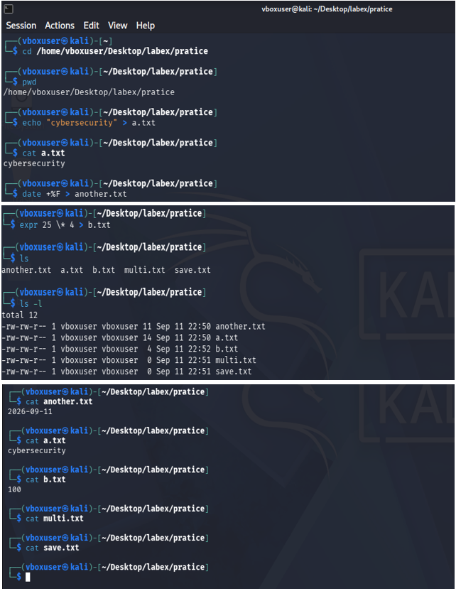

# 🧪 Final Mini Challenge — Linux & Cybersecurity

## 📌 About This Challenge

This mini challenge is designed to practice basic Linux terminal commands without simply copying the exact command sequence from the lesson.

The main goal is to understand the **reason behind each command** and connect basic Linux operations with cybersecurity concepts.

Instead of memorizing commands, I am practicing this mindset:

```text
What did I type?
       ↓
Why did I type it?
       ↓
What did Linux do?
       ↓
Where was the output?
       ↓
What changed?
       ↓
What cybersecurity concept does this connect to?
```

---

# 🎯 Challenge Tasks

The challenge requires me to:

1. Move into my practice directory.
2. Confirm my current location.
3. Create a file containing my own sentence about cybersecurity.
4. Read the file.
5. Save today's date into another file.
6. Perform `25 × 4`.
7. Save the result into a file.
8. List the files.
9. Inspect the files using `ls -l`.
10. Clear the terminal.
11. Confirm that the files still exist.

---

# 💻 Solution

## 1. Move into the practice directory

```bash
cd ~/practice
```

### Why?

`cd` means **change directory**. It moves me from my current location into the directory where I want to perform the challenge.

### What did Linux do?

Linux changed my current working directory.

### Where was the output?

There is normally no output. The important change is my current location.

### Cybersecurity connection

You have to move around in the filesystem is important when working with files, logs, scripts, configuration files, and security tools.

---

## 2. Confirm my location

```bash
pwd
```

### Why?

`pwd` means **Print Working Directory**. It confirms exactly where I am.

### What did Linux do?

Linux displayed the absolute path of my current directory.

### Where was the output?

The path appeared directly in the terminal.

### Cybersecurity connection

Before creating, modifying, or deleting files, I should know **which directory I am working in**. This helps prevent mistakes.

---

## 3. Create a cybersecurity file

```bash
echo "Cybersecurity protects systems, networks, and data from unauthorized access." > cybersecurity.txt
```

### Why?

I wanted to create a file containing my own sentence about cybersecurity.

### What did Linux do?

`echo` produced the sentence.

The `>` operator redirected that output into:

```text
cybersecurity.txt
```

If the file did not exist, Linux created it.

### Where was the output?

Instead of appearing on the terminal, the sentence was written into the file.

### Cybersecurity connection

This introduces an important Linux concept:

**output redirection**

Security professionals frequently redirect command output into files for logging, analysis, evidence collection, and automation.

---

## 4. Read the file

```bash
cat cybersecurity.txt
```

### Why?

I wanted to verify what was stored inside the file.

### What did Linux do?

`cat` displayed the contents of `cybersecurity.txt`.

### Where was the output?

The sentence appeared in the terminal.

### Cybersecurity connection

Reading files is fundamental in cybersecurity because security analysts regularly inspect:

* logs
* configuration files
* reports
* scripts
* system information
* forensic evidence

---

## 5. Save today's date into another file

```bash
date > today.txt
```

### Why?

I wanted to obtain the current system date and save it into a file.

### What did Linux do?

The `date` command generated the current date and time.

The `>` operator redirected that output into:

```text
today.txt
```

### Where was the output?

The date was stored inside the file instead of being displayed directly on the terminal.

### Cybersecurity connection

Dates and timestamps are extremely important in cybersecurity.

They can help analysts determine:

* when an event occurred
* when a file was created or modified
* the sequence of events during an investigation
* possible suspicious activity

---

## 6. Perform `25 × 4`

```bash
expr 25 \* 4
```

### Why?

I needed Linux to calculate:

```text
25 × 4
```

### What did Linux do?

`expr` evaluated the mathematical expression.

The `\*` is used because `*` has a special meaning in the Linux shell.

### Output

```text
100
```

### Cybersecurity connection

Command-line calculations are useful when working with scripts, data, permissions, sizes, timestamps, and other automation tasks.

---

## 7. Save the result into a file

```bash
expr 25 \* 4 > result.txt
```

### Why?

Instead of only displaying the answer, I wanted to save the result for later use.

### What did Linux do?

Linux calculated:

```text
25 × 4 = 100
```

and redirected the result into:

```text
result.txt
```

### Where was the output?

The result was stored inside the file.

The file should contain:

```text
100
```

### Cybersecurity connection

This is another example of **output redirection**.

Security scripts often save command results into files so that the information can be reviewed, compared, processed, or used later.

---

# 8. List the files

```bash
ls
```

### Why?

I wanted to see which files currently exist in the practice directory.

### What did Linux do?

`ls` displayed the directory contents.

I should see files similar to:

```text
cybersecurity.txt
result.txt
today.txt
```

### Cybersecurity connection

Listing files is a basic part of filesystem awareness.

In cybersecurity, discovering files can help identify:

* configuration files
* logs
* scripts
* suspicious files
* user-created files
* potentially malicious files

---

# 9. Inspect the files with `ls -l`

```bash
ls -l
```

### Why?

`ls` only gives a basic listing. `ls -l` gives more detailed information.

### What did Linux show?

The long listing can contain information such as:

```text
permissions
owner
group
file size
date/time
filename
```

Example:

```text
-rw-r--r-- 1 user user 75 Sep 12 06:00 cybersecurity.txt
```

### Cybersecurity connection

This is especially important for cybersecurity because **file permissions and ownership control who can access or modify files**.

For example:

```text
-rw-r--r--
```

contains permission information for:

* owner
* group
* others

Understanding Linux permissions is an important cybersecurity skill.

---

# 10. Clear the terminal

```bash
clear
```

### Why?

I wanted to remove the previous terminal output from the screen and start with a clean terminal.

### What did Linux do?

It cleared the visible terminal screen.

### Important point

`clear` does **not** delete my files.

It only clears the terminal display.

### Cybersecurity connection

This helps demonstrate the difference between:

**clearing the screen**

and

**deleting data**.

The files remain stored on the filesystem.

---

# 11. Confirm that the files still exist

```bash
ls
```

### Why?

After clearing the terminal, I wanted to verify that my files were still present.

### What did Linux do?

Linux listed the directory contents again.

The files should still exist:

```text
cybersecurity.txt
result.txt
today.txt
```

### Cybersecurity connection

This demonstrates an important concept:

> The terminal display and the filesystem are two different things.

Clearing what I can see on the screen does not remove the actual data stored on disk.

---

# 🧠 What I Learned

This challenge was not only about learning commands.

I practiced several important Linux concepts:

| Concept                   | Command / Operator |
| ------------------------- | ------------------ |
| Change directory          | `cd`               |
| Check current location    | `pwd`              |
| Create/write a file       | `echo` + `>`       |
| Read a file               | `cat`              |
| Get date/time             | `date`             |
| Perform calculation       | `expr`             |
| Redirect output           | `>`                |
| List files                | `ls`               |
| Detailed file information | `ls -l`            |
| Clear terminal            | `clear`            |

---

# 🔐 Cybersecurity Connections

The challenge connects basic Linux commands to several cybersecurity concepts:

### 1. Filesystem Awareness

Cybersecurity professionals need to understand where files are located and how the Linux filesystem is organized.

### 2. File Permissions

`ls -l` exposes permissions and ownership information, which are essential for Linux security.

### 3. Output Redirection

The `>` operator allows command output to be saved into files.

This concept is useful for:

* logging
* automation
* security scripts
* evidence collection
* command output analysis

### 4. Timestamps

The `date` command introduces the importance of timestamps.

Timestamps are heavily used when investigating security incidents.

### 5. Data Verification

Reading files and checking them again helps verify that the expected data was actually created and stored.

### 6. Command-Line Skills

The Linux command line is an important environment for cybersecurity tools, system administration, automation, and security analysis.

---

# Strategy used

The most important lesson from this challenge is that I should not learn Linux as a collection of commands to memorize.

For every command, I should ask:

```text

Why did I type it?
       ↓
What did Linux do?
       ↓
Where did the output go?
       ↓
What changed?
       ↓
How can this be useful in cybersecurity?
```

This approach helps turn **Linux commands into actual cybersecurity knowledge**.

---

# ✅ Challenge Completed

Through this mini challenge, I practiced:

* navigating directories
* verifying my location
* creating files
* reading files
* saving command output
* performing calculations
* listing files
* inspecting permissions and metadata
* clearing the terminal
* verifying that files still exist




This is a small exercise, but these fundamentals will become useful later when working with **Linux administration, cybersecurity tools, scripting, logs, permissions, and security investigations**.
