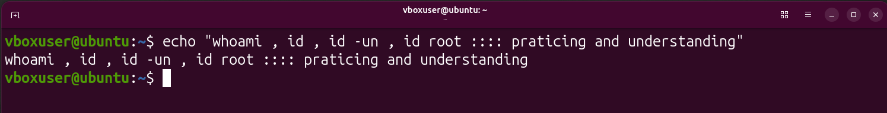
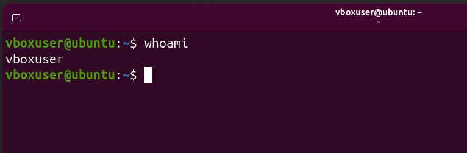
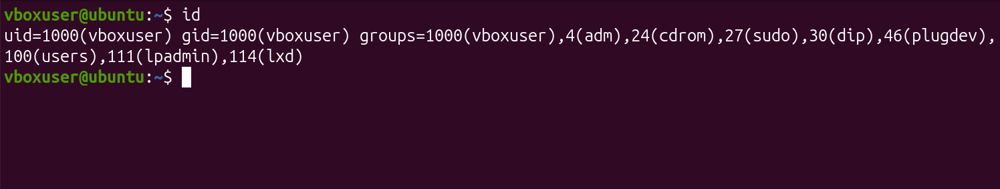
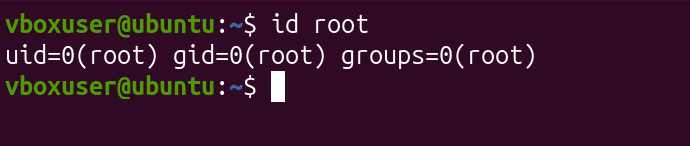
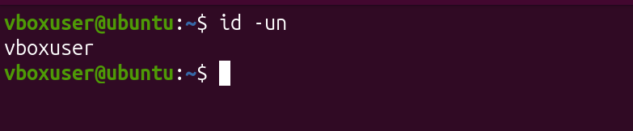

# 🐧Lab 01 — Linux Identity & Basic Commands

> **Cybersecurity/Linux Journey → Grasshopper → 01 Getting Started → 01 Linux History → Lab 02**

This lab is my first practical step into **Linux and cybersecurity**.

The purpose of this lab is not simply to memorize commands. It is to understand a fundamental cybersecurity question:

> **"Who am I on this Linux system, and what am I allowed to do?"**

Before administering, troubleshooting, defending, or testing a Linux system, understanding the current user's identity and privileges is essential.

---

## 📌 Lab Overview

| Item                    | Details                                        |
| ----------------------- | ---------------------------------------------- |
| **Lab**                 | Your First Linux Lab                           |
| **Level**               | Beginner                                       |
| **Focus**               | Linux Identity, Users, Groups & Basic Commands |
| **Environment**         | Linux / LabEx                                  |
| **Main Commands**       | `echo`, `whoami`, `id`, `id root`, `id -un`    |
| **Cybersecurity Focus** | Identity & Privilege Awareness                 |
| **Status**              | ✅ Completed                                    |

---

# 🎯 Learning Objectives

By completing this lab, I learned how to:

* Understand what the Linux terminal is.
* Understand Linux case sensitivity.
* Identify the current Linux user.
* Understand **UID** and **GID**.
* Understand Linux groups.
* Distinguish between:

  * `root`
  * standard users
  * service accounts
* Understand the difference between **root** and **sudo**.
* Check the groups associated with a user.
* Understand why groups matter in cybersecurity.
* Check the identity of the `root` account.
* Understand the basic purpose of `echo`.
* Recognize the relationship between Linux identity and privilege.
* Develop the habit of checking identity before performing security-related tasks.

---

# 1. 🖥️ What Is the Linux Terminal?

The **terminal** is a text-based interface used to communicate with Linux by typing commands.

Instead of interacting with a graphical interface using buttons and menus, we can directly tell Linux what to do.

### Basic model

```text
┌──────────┐
│   User   │
└────┬─────┘
     │
     │ Command
     ▼
┌──────────┐
│  Linux   │
└────┬─────┘
     │
     │ Output
     ▼
┌──────────┐
│   User   │
└──────────┘
```

For cybersecurity, the terminal is extremely important because:

* Linux administration is heavily command-line based.
* Many security tools are operated through the terminal.
* Security analysts frequently inspect users, processes, files, permissions, logs, and network activity through CLI tools.
* Automation and scripting depend heavily on command-line tools.

---

# 2. 🔤 Linux Is Case-Sensitive

Linux treats uppercase and lowercase characters as different.

For example:

```bash
echo
Echo
ECHO
```

These are not necessarily the same command.

The standard command is:

```bash
echo
```

### Spaces also matter

```bash
echo "Hello"
```

Here:

```text
echo       → command
"Hello"    → argument/text
```

The shell interprets commands according to their syntax, so spaces, quotation marks, capitalization, and special characters can change the meaning.

### Beginner rule

> **Type Linux commands exactly as intended.**

---

# 3. 👤 The Core Linux Identity Model

For this lab, the most important concepts are:

```text
User
  ↓
UID
  ↓
Groups
  ↓
Permissions
```

Think of a Linux system as a building.

| Linux Concept | Real-World Analogy                      |
| ------------- | --------------------------------------- |
| User          | Person in the building                  |
| UID           | Person's identification number          |
| Group         | Team / department                       |
| Permissions   | Doors the person can access             |
| Root          | Building manager with maximum authority |

This simple model becomes extremely useful when learning Linux security.

---

# 4. 👀 `whoami` — Who Am I?

The command:

```bash
whoami
```

prints the username associated with the current effective user identity. GNU Coreutils documents `whoami` as equivalent to `id -un`.

### Example

```bash
whoami
```

Possible output:

```text
vboxuser
```

This means:

> The current effective Linux user is `vboxuser`.

### Mental model

```text
whoami
   ↓
"Who am I?"
   ↓
vboxuser
```

### Why is this important in cybersecurity?

Before performing administrative or security-related work, I should know which account my commands are running under.

---

# 5. 👥 Linux Users

Linux can contain multiple user accounts.

Examples:

```text
root
vboxuser
ali
labex
www-data
```

These accounts may have very different purposes and privileges.

A Linux system does **not** treat every account equally.

---

# 6. 🆔 UID — User ID

Every Linux user has a numerical identifier called a **UID**.

For example:

```text
uid=1000(vboxuser)
```

This means:

```text
Username → vboxuser
UID      → 1000
```

### Simple definition

> **UID = numerical identifier assigned to a Linux user.**

The most important UID to remember for Linux administration and security is:

```text
UID 0 = root / superuser
```

---

# 7. 🆔 GID — Group ID

A **GID** is the numerical identifier of a group.

For example:

```text
gid=1000(vboxuser)
```

means:

```text
GID      → 1000
Group    → vboxuser
```

### Simple definition

> **GID = numerical identifier assigned to a Linux group.**

For now, the important distinction is:

```text
UID → identifies a user
GID → identifies a group
```

---

# 8. 👥 Groups

A Linux user can belong to multiple groups.

For example:

```text
vboxuser
   │
   ├── vboxuser
   ├── sudo
   └── cdrom
```

Groups can be used to control access to resources and system functionality.

### University analogy

A student might belong to:

```text
Student
   │
   ├── BSCS
   ├── Cybersecurity Club
   ├── Lab Group
   └── Sports Society
```

Similarly, a Linux account can belong to multiple groups.

---

# 9. 🔎 `id` — Complete Identity Information

The command:

```bash
id
```

provides identity information about the current user, including:

* UID
* username
* primary GID
* group memberships

Example:

```text
uid=1000(vboxuser) gid=1000(vboxuser) groups=1000(vboxuser),27(sudo),24(cdrom)
```

Do not try to understand everything at once.

Start with:

```text
uid=1000(vboxuser)
```

Then:

```text
gid=1000(vboxuser)
```

Then:

```text
groups=...
```

---

# 10. 🧩 Understanding an `id` Output

Suppose:

```bash
id
```

returns:

```text
uid=1000(vboxuser) gid=1000(vboxuser) groups=1000(vboxuser),27(sudo),24(cdrom)
```

Break it down:

```text
uid=1000(vboxuser)
│
├── UID = 1000
└── User = vboxuser
```

```text
gid=1000(vboxuser)
│
├── GID = 1000
└── Primary group = vboxuser
```

```text
groups=1000(vboxuser),27(sudo),24(cdrom)
│
├── vboxuser
├── sudo
└── cdrom
```

Therefore, this user belongs to multiple groups.

---

# 11. 🔐 Why Groups Matter in Cybersecurity

The `id` command answers:

> **"Which groups does my current user belong to?"**

It does **not** automatically explain everything each group can access.

For example:

```bash
id
```

might show:

```text
groups=1000(vboxuser),27(sudo)
```

This tells me:

> My account belongs to the `sudo` group.

It does not mean:

> `id` has explained every permission associated with `sudo`.

Those are two separate questions.

### Investigating a group

A command such as:

```bash
getent group sudo
```

can be used later to inspect group membership information.

For this beginner lab, however, the important concept is simply:

```text
id
 ↓
Identity
 ↓
UID + GID + Groups
```

---

# 12. 👑 Linux Account Types

Linux systems commonly contain different kinds of accounts.

For beginner-level understanding, three useful categories are:

## 12.1 Root / Superuser

```text
root
UID = 0
```

`root` is the Linux superuser account.

It has extremely broad authority over the system and can generally bypass ordinary file permission restrictions.

---

## 12.2 Standard User

Example:

```text
vboxuser
```

A standard human user normally has limited privileges.

For example, the user may be able to:

* Work inside their home directory.
* Run normal applications.
* Create and modify their own files.
* Use system resources allowed to their account.

Administrative actions may require additional authorization.

> Note: UID ranges can vary by Linux distribution and configuration, so `UID >= 1000` should be treated as a common convention for human users rather than an absolute universal rule.

---

## 12.3 Service Accounts

Examples include:

```text
www-data
nobody
sshd
```

Service accounts are commonly used by software and system services.

For example:

```text
Web Server
     ↓
www-data
```

The purpose is often to prevent a compromised service from automatically having unrestricted control over the entire operating system.

> Service-account UID ranges also vary between distributions and configurations, so the account's actual identity and permissions should be inspected rather than relying only on a UID-number rule.

---

# 13. 🔍 How Do I Know If I Am Root?

### Method 1 — `whoami`

```bash
whoami
```

If the output is:

```text
root
```

you are using the root account.

If the output is:

```text
vboxuser
```

you are not logged in as the root account.

---

### Method 2 — `id`

Run:

```bash
id
```

If you see:

```text
uid=0(root)
```

your current effective UID is 0.

That means the current effective identity is root/superuser.

If you see:

```text
uid=1000(vboxuser)
```

you are operating as `vboxuser`, not the root account.

### Most important rule

```text
UID 0 → root / superuser
```

---

# 14. 👑 `root` vs `sudo`

This was an important concept to clarify.

## `root`

`root` is a **Linux user/account identity**.

```text
root
 ↓
Linux account
 ↓
UID 0
 ↓
Superuser
```

---

## `sudo`

`sudo` is a **command/mechanism for executing commands with elevated privileges when the system authorizes the user to do so**.

For example:

```bash
sudo apt update
```

You may still be logged in as:

```text
vboxuser
```

while that particular command is executed with elevated privileges.

Therefore:

```text
root = account / identity

sudo = privilege-elevation mechanism
```

This distinction is fundamental to Linux security.

---

# 15. ⚡ Privilege Escalation

In cybersecurity, **privilege escalation** means obtaining privileges beyond those initially available to an account or process.

The general idea is:

```text
Restricted User
      │
      │ vulnerability / misconfiguration /
      │ exposed credential / excessive privilege
      ▼
Higher Privileges
      │
      ▼
Administrative / Root-Level Control
```

### Real-world analogy

Imagine entering a high-security building as an intern.

You have access to:

```text
Your office ✓
Common areas ✓
Server room ✗
Manager's office ✗
Security control room ✗
```

If you discover an unauthorized path that gives you the manager's master access card, you have effectively escalated your privileges.

In Linux security, privilege escalation is studied to understand how attackers may move from limited access toward higher privileges.

---

# 16. 🧱 Common Privilege-Escalation Concepts

> These are concepts to understand in controlled labs and authorized environments—not instructions for attacking real systems.

### 1. Misconfigured privileges

A user may accidentally receive excessive permissions through groups, file permissions, services, or system configuration.

Example concept:

```text
Standard User
      ↓
Overly powerful group membership
      ↓
Unexpected administrative capability
```

---

### 2. Vulnerable privileged software

A program may run with elevated privileges.

If the program contains a serious vulnerability, exploitation may potentially allow an attacker to perform actions with the program's privileges.

Conceptually:

```text
User
 ↓
Vulnerable privileged program
 ↓
Higher privileges
```

---

### 3. Exposed credentials

Sensitive credentials may accidentally be stored in:

* Configuration files
* Scripts
* Environment variables
* Logs
* Backups

If an unauthorized user obtains valid privileged credentials, those credentials may provide access they should not have.

### Security lesson

> **Least privilege and proper credential protection are fundamental defensive controls.**

---

# 17. 🎯 `id root` — Understanding the Root Account

The command:

```bash
id root
```

asks Linux for identity information about the account named `root`.

Typical output:

```text
uid=0(root) gid=0(root) groups=0(root)
```

This tells us:

```text
Account      → root
UID          → 0
Primary GID  → 0
Groups       → root
```

### Important correction

`id root` does **not** list all privileges that root has.

It tells us about the identity and group information of the `root` account.

We know that UID 0 represents the superuser identity, and therefore `root` is the administrative account.

---

# 18. 📢 `echo` — Display Text

The command:

```bash
echo "Hello"
```

prints text to the terminal.

Output:

```text
Hello
```

Think of `echo` as:

> **"Display this."**

Example:

```bash
echo "I am learning Linux"
```

Output:

```text
I am learning Linux
```

---

# 19. 🌐 `echo` and Environment Variables

Later, `echo` becomes useful for displaying environment variables.

For example:

```bash
echo $USER
```

may output:

```text
vboxuser
```

Here:

```text
echo   → display
$USER  → value of the USER environment variable
```

Another example:

```bash
echo $PATH
```

This displays the directories contained in the `PATH` environment variable.

### Important distinction

```bash
echo "Hello"
```

means:

> Display the literal text `Hello`.

While:

```bash
echo $USER
```

means:

> Display the current value stored in `USER`.

Environment variables will be studied separately in more detail.

---

# 20. 🛠️ Why `echo` Matters in Cybersecurity

`echo` is a simple command, but it becomes useful in:

### Testing

```bash
echo "Test successful"
```

### Scripts

```bash
echo "Step 1 completed"
```

### Debugging

A script can print markers to show which stage has executed.

### Environment inspection

```bash
echo $USER
echo $PATH
```

The command itself is simple; its usefulness increases when combined with shell scripting and system administration.

---

# 21. 🧾 Command Cheat Sheet

| Command        | Purpose                     | Simple Meaning                            |
| -------------- | --------------------------- | ----------------------------------------- |
| `echo "Hello"` | Displays text               | Show this text                            |
| `whoami`       | Shows effective username    | Who am I?                                 |
| `id`           | Shows UID, GID and groups   | What is my identity?                      |
| `id root`      | Shows root account identity | What is root's identity?                  |
| `id -un`       | Shows effective username    | Give me my username                       |
| `echo $USER`   | Displays `USER` variable    | What username is stored here?             |
| `echo $PATH`   | Displays `PATH`             | Where does the shell search for commands? |

---

# 22. 🧠 `whoami` vs `id` vs `id -un`

This is an important distinction.

```text
whoami
   ↓
Current effective username
```

```text
id
   ↓
UID + GID + Groups + Username
```

```text
id -un
   ↓
Current effective username
```

In fact:

```text
whoami ≈ id -un
```

GNU Coreutils documents `whoami` as equivalent to `id -un`.

### Memory trick

```text
whoami → Who am I?

id     → What is my identity?

id -un → Username only
```

---

# 23. 🔬 Mini Challenge — Know Your Linux Identity

Try completing these tasks without copying the exact command sequence from the lesson.

### Task 1

Display a greeting containing your own message.

### Task 2

Find your current username.

### Task 3

Display your complete user and group information.

### Task 4

Check the identity information of the root account.

### Task 5

Display only your username using `id`.

### Task 6

Compare the commands and decide:

* Which command gives the most identity information?
* Which commands give only the username?
* Which command displays arbitrary text?

---

# 24. ✅ Mini Challenge — Solution

Possible solutions:

### 1. Display a greeting

```bash
echo "Hello, Linux!"
```

### 2. Find current username

```bash
whoami
```

### 3. Display complete identity information

```bash
id
```

### 4. Check root identity

```bash
id root
```

### 5. Display username using `id`

```bash
id -un
```

### 6. Compare them

```text
id
 ↓
Most identity information
```

```text
whoami
id -un
 ↓
Username
```

```text
echo
 ↓
Displays supplied text/value
```

---

# 25. 🔐 Cybersecurity Mindset

A fundamental security habit is:

> **Know your identity before you act.**

Before performing security analysis, administration, troubleshooting, or testing, ask:

```text
Who am I?
    ↓
What is my UID?
    ↓
What is my primary group?
    ↓
What other groups do I belong to?
    ↓
What privileges might those groups provide?
    ↓
What resources can I access?
```

This creates the foundation for understanding:

* Linux permissions
* Access control
* Privilege escalation
* Least privilege
* Service security
* System administration
* Security auditing

---

# 26. 🧩 The Big Picture

All the commands in this lab connect together:

```text
                    LINUX IDENTITY
                         │
             ┌───────────┴───────────┐
             │                       │
           User                    Groups
             │                       │
            UID                     GID
             │                       │
             └───────────┬───────────┘
                         │
                    Permissions
                         │
                         ▼
                    Capabilities
                         │
                         ▼
               Security Boundary
```

The important progression is:

```text
whoami
  ↓
Who am I?

id
  ↓
What is my UID/GID/groups?

id root
  ↓
What is the identity of root?

echo
  ↓
Can I display information / test shell behavior?
```

---

# 27. 📸 Lab Evidence

The following screenshots document the commands executed during this lab:

### `echo` Command



### `whoami` Command



### `id` Command



### `id root` Command



### `id -un` Command



---

# 28. 📁 Repository Structure

```text
Lab-02-Your-First-Linux-Lab/
│
├── README.md
│
└── Screenshots/
    ├── echo-command.png
    ├── id-command.png
    ├── id-root-command.png
    ├── id-un-command.png
    └── whoami-command.png
```

This structure keeps the written explanation separate from the practical evidence.

---

# 29. 📚 Key Takeaways

After completing this lab, I should be able to explain:

### Terminal

> A command-line interface used to interact with Linux.

### User

> A Linux account representing a person, service, or other system identity.

### UID

> The numerical identifier of a user.

### GID

> The numerical identifier of a group.

### Group

> A collection used to organize users and control access.

### Root

> The Linux superuser identity associated with UID 0.

### Sudo

> A mechanism that can allow an authorized user to execute commands with elevated privileges.

### `whoami`

> Shows the current effective username.

### `id`

> Shows identity information including UID, GID, and group memberships.

### `id root`

> Shows identity information for the root account.

### `id -un`

> Shows the current effective username.

### `echo`

> Displays text or the value of an expression/variable.

---

# 30. 🧠 One-Page Memory Map

```text
                    🐧 LINUX IDENTITY
                           │
          ┌────────────────┼────────────────┐
          │                │                │
         USER             UID             GROUPS
          │                │                │
     vboxuser            1000        sudo / cdrom / ...
          │
          ▼
       `whoami`
          │
          ▼
     "Who am I?"

          ┌───────────────────────────────┐
          │
          ▼
        `id`
          │
          ├── UID
          ├── GID
          └── Groups

          ┌───────────────────────────────┐
          │
          ▼
      `id root`
          │
          ▼
     root → UID 0

          ┌───────────────────────────────┐
          │
          ▼
       `id -un`
          │
          ▼
      Username only

          ┌───────────────────────────────┐
          │
          ▼
        `echo`
          │
          ▼
      Display text/value
```

---

# 31. 🛡️ Cybersecurity Connection

This lab may look simple because the commands are simple.

However, the underlying concept is fundamental.

A cybersecurity professional must understand:

```text
Identity
   ↓
Authentication
   ↓
Authorization
   ↓
Permissions
   ↓
Privileges
   ↓
Access
```

This lab focuses primarily on the first part:

```text
WHO AM I?
```

Later Linux labs will build on this foundation to explore:

```text
Users
   ↓
Groups
   ↓
File Permissions
   ↓
Processes
   ↓
Services
   ↓
Networking
   ↓
Logs
   ↓
Security Controls
   ↓
Privilege Escalation
```

---

# 🏁 Final Reflection

The main lesson from this lab is not memorizing five commands.

It is developing a **security mindset**.

Before interacting with a Linux system, I should first establish:

```text
Who am I?
What UID do I have?
What groups am I in?
What level of access do I have?
```

The most important concepts I learned are:

```text
UID 0      → root / superuser

whoami     → current effective username

id         → UID + GID + groups

id root    → root account identity

id -un     → username

echo       → display text/value

sudo       → mechanism for authorized privilege elevation
```

> **Cybersecurity principle:**
> **Before attacking, defending, troubleshooting, or administering a Linux system, first understand your identity and privilege boundary.**

---

## 🚀 Next Step

This lab establishes the foundation for the next Linux concepts:

```text
Identity
   ↓
Users & Groups
   ↓
File Ownership
   ↓
Permissions
   ↓
chmod / chown
   ↓
Processes & Services
   ↓
Networking
   ↓
Linux Security
```

**Foundation first. Security skills later.**

---

## 📖 References

* GNU Coreutils documentation — `whoami`, `id`, and user/group information.

---

### 🏷️ Topics Covered

`Linux` · `Linux Basics` · `Cybersecurity` · `Terminal` · `CLI` · `Users` · `UID` · `GID` · `Groups` · `Root` · `Sudo` · `Privileges` · `Privilege Escalation` · `whoami` · `id` · `echo` · `Linux Administration` · `Security Fundamentals`
