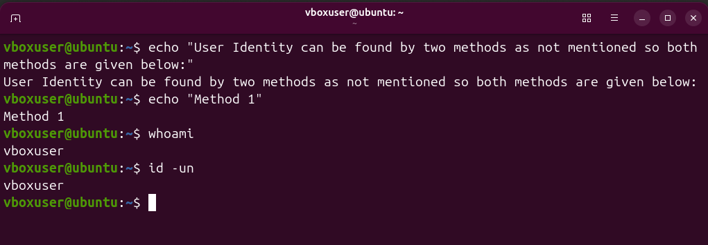
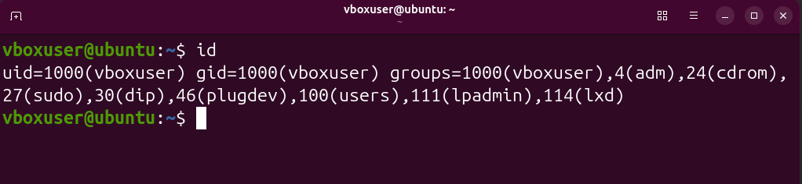

# Lab 02 — Display User and Group Information

> **Linux Journey • Grasshopper • Getting Started • Choosing a Linux Distribution**

This challenge focuses on identifying the current Linux user and inspecting the user's identity and group memberships.

---

## 📌 Overview

In Linux, knowing **which user is currently running a shell** and **which groups that user belongs to** is essential for understanding permissions, access, and privilege levels.

This LabEx challenge covers two basic commands:

* `whoami` — displays the current username.
* `id` — displays detailed user and group information.

These commands are small but fundamental for Linux administration and cybersecurity.

---

## 🎯 Objectives

By completing this challenge, I learned how to:

* Identify the currently logged-in Linux user.
* Display the user's UID.
* Display the user's primary GID.
* Inspect supplementary group memberships.
* Understand how user identity relates to Linux permissions.

---

# 1. Display Current User Identity

### Command

```bash
whoami
```

### What it does

`whoami` displays the **username of the user currently running the shell**.

### Example

```bash
whoami
```

Example output:

```text
labex
```

The exact username depends on the Linux environment.

### Why it matters

Before performing administrative, troubleshooting, or security-related tasks, it is useful to confirm **which account you are actually using**.

### Solved Task

The current user identity was successfully displayed using `whoami`.

### Screenshot



---

# 2. Display Detailed User & Group Information

### Command

```bash
id
```

### What it does

`id` displays detailed information about the current user, including:

* **UID** — User ID
* **GID** — primary Group ID
* **groups** — groups the user belongs to

### Example

```bash
id
```

Example output:

```text
uid=1000(labex) gid=1000(labex) groups=1000(labex)
```

The numbers and group names can be different on another Linux system.

### Understanding the output

```text
uid=1000(labex)
│        │
│        └── Username
└────────── User ID

gid=1000(labex)
│        │
│        └── Primary group
└────────── Group ID

groups=...
└── Groups the user belongs to
```

### Why it matters

Linux permissions depend heavily on **users and groups**. Checking group membership can help explain why a user can or cannot access a file, directory, or system resource.

### Solved Task

Detailed user and group information was successfully displayed using `id`.

### Screenshot



---

# 🔐 Cybersecurity Relevance

User identity and group membership are important during Linux security assessments.

A security analyst may first check:

```bash
whoami
id
```

to determine:

* Which account is being used.
* What privileges the account may have.
* Which groups provide additional access.
* The execution context of a command, script, or service.

Understanding identity and groups is therefore a foundation for **Linux permissions, privilege management, and privilege escalation analysis**.

---

# 📋 Commands Used

| Command  | Purpose                                 |
| -------- | --------------------------------------- |
| `whoami` | Displays the current username           |
| `id`     | Displays UID, GID, and group membership |

---

# 🧪 Challenge Summary

| Task                               | Command  | Status      |
| ---------------------------------- | -------- | ----------- |
| Display current user identity      | `whoami` | ✅ Completed |
| Display user and group information | `id`     | ✅ Completed |

---

# 🧠 Key Takeaways

* `whoami` answers **"Which user am I?"**
* `id` provides **detailed identity information**.
* **UID** identifies a user.
* **GID** identifies a group.
* A user can belong to multiple groups.
* User and group information is directly related to **Linux permissions and security**.

---

## 📚 Further Learning

Linux manual pages can provide additional information:

```bash
man whoami
```

```bash
man id
```

---

## 👤 Author

**Muhammad Mehrab Ali**

Cybersecurity-Focused CS Student | Linux & Cybersecurity Learning Journey

This challenge is part of my hands-on **Linux and Cybersecurity learning journey**, documenting practical labs, commands, concepts, and security fundamentals.

---

## 🗂️ Repository Path

```text
Cybersecurity/
└── Linux/
    └── Linux-journey/
        └── Grasshopper/
            └── 01-Getting-Started/
                └── 02-Choosing-a-Linux-Distribution/
                    └── Lab-01-Quic-Start-with-Linux/
                        └── Lab-02-Display-User-and-Group-Information/
                            ├── README.md
                            └── Screenshots/
                                ├── Current-User-Identity.png
                                └── Detailed-User-and-Group-Information.png
```

---

> **LabEx Challenge:** Display User and Group Information
> **Focus:** Linux User Identity • UID • GID • Groups • Permissions
> **Author:** Muhammad Mehrab Ali
# Lab 02 — Display User and Group Information

> **Linux Journey · Grasshopper · Getting Started**

## 📌 Overview

This LabEx challenge focuses on identifying the **current Linux user** and inspecting the user's **UID, GID, and group memberships**.

Understanding user identity and group membership is essential for working with Linux permissions, access control, privilege management, and security troubleshooting.

---

## 🎯 Objectives

By completing this challenge, I learned how to:

* Identify the currently logged-in Linux user.
* Display detailed user and group information.
* Understand **UID**, **GID**, and group memberships.
* Verify the execution identity of a Linux shell.

---

## 1. Current User Identity

### Command

```bash
whoami
```

### What it does

Displays the username of the user currently running the shell.

### Example

```bash
whoami
```

Example output:

```text
labex
```

### Solved Challenge

---

## 2. Detailed User and Group Information

### Command

```bash
id
```

### What it does

Displays detailed information about the current user, including:

* **UID** — User ID
* **GID** — Primary Group ID
* **groups** — Groups the user belongs to

### Example

```bash
id
```

Example output:

```text
uid=1000(labex) gid=1000(labex) groups=1000(labex),27(sudo)
```

> The actual UID, GID, username, and groups depend on the Linux environment.

### Understanding the Output

```text
uid=1000(labex)
│       │
│       └── Username
└────────── User ID

gid=1000(labex)
│       │
│       └── Primary group
└────────── Group ID
```

### Solved Challenge

---

## 🔐 Cybersecurity Relevance

User and group identification is a basic but important part of Linux security.

Before investigating permissions, privileges, or access problems, a security analyst should know:

```text
Who am I?
   ↓
What is my UID?
   ↓
What is my primary GID?
   ↓
Which groups do I belong to?
   ↓
What resources can I potentially access?
```

Group membership can affect a user's access to files, directories, devices, and administrative functions.

---

## 📋 Commands Used

| Command  | Purpose                                  |
| -------- | ---------------------------------------- |
| `whoami` | Displays the current username            |
| `id`     | Displays UID, GID, and group memberships |

---

## 🧠 Key Takeaways

* `whoami` → **Who am I?**
* `id` → **Who am I + UID + GID + groups**
* **UID** identifies a user.
* **GID** identifies a group.
* Group membership can influence Linux permissions and access.

---

## 🧪 Challenge Summary

**Challenge:** Display User and Group Information
**Platform:** LabEx
**Area:** Linux Fundamentals
**Focus:** User Identity & Group Management
**Status:** ✅ Completed

---

## 👤 Author

**Muhammad-Mehrab-Ali-dev**

Cybersecurity-Focused CS Student | Linux & Cybersecurity Learner

This lab is part of my ongoing **Linux → Cybersecurity learning journey**, where I am building practical skills through hands-on labs, challenges, and documented projects.

---

### 📚 Learning Path

**Cybersecurity → Linux → Linux Journey → Grasshopper → Getting Started → Lab 02**

The purpose of this repository is to document my practical learning progress and build a strong foundation in **Linux, cybersecurity, networking, and security operations**.

