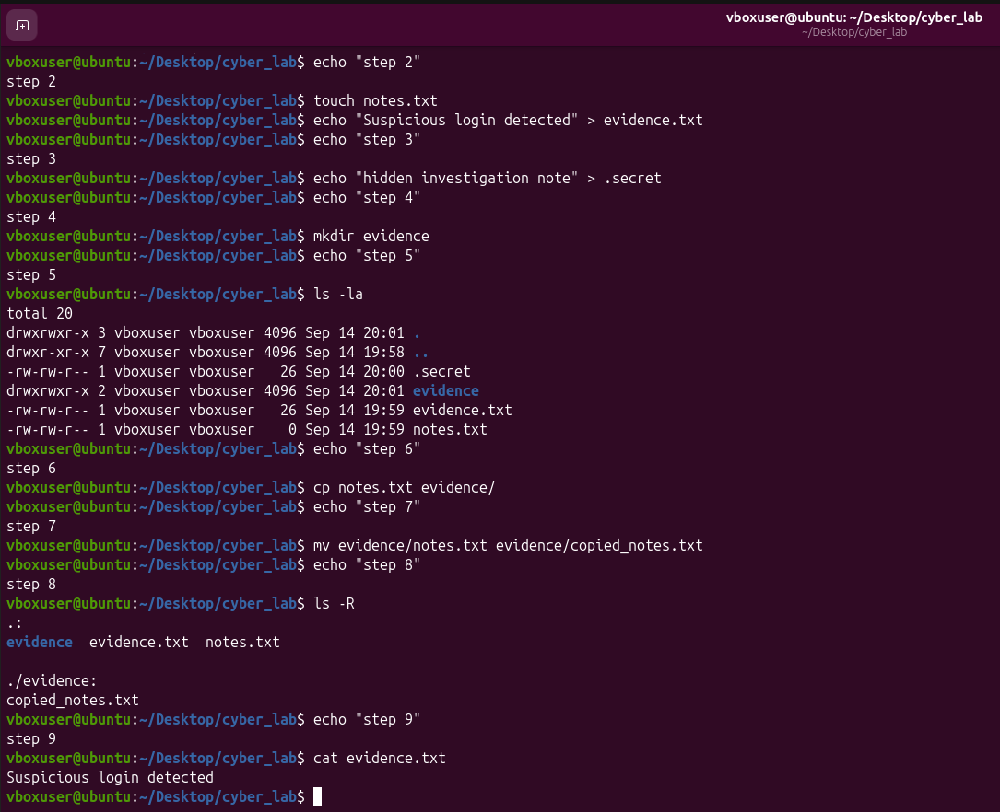

# 🔎 Linux File Investigation — Mini Project

> **Hands-on Linux file operations lab focused on creating, inspecting, hiding, copying, renaming, and investigating files and directories.**

This mini-project is part of my **Cybersecurity/Linux Journey** and demonstrates practical Linux command-line skills through a small simulated file-investigation scenario.

The goal was not only to execute commands, but also to understand **how Linux represents files, directories, hidden files, file paths, and basic evidence-handling operations**.

---

## 🎯 Mission

Create and investigate the following Linux filesystem structure:

```text
cyber_lab/
├── notes.txt
├── evidence.txt
├── .secret
└── evidence/
    └── copied_notes.txt
```

The project simulates a simple cybersecurity investigation workspace where files are created, inspected, copied, renamed, and examined.

---

## 🧠 Skills Demonstrated

Through this lab, I practiced:

* 📁 Creating directories with `mkdir`
* 📄 Creating files with `touch`
* ✍️ Writing data into files with `echo`
* 🕵️ Creating and identifying hidden files
* 👀 Listing normal and hidden files with `ls -la`
* 📋 Copying files with `cp`
* 🔄 Moving and renaming files with `mv`
* 🌳 Investigating directory contents recursively with `ls -R`
* 📖 Reading file contents with `cat`
* 🛡️ Applying basic Linux skills in a cybersecurity investigation scenario
* 🧭 Understanding relative file paths and directory structure

---

# 🧪 Lab Walkthrough

## Step 1 — Create the Investigation Workspace

First, I created a dedicated directory for the investigation.

```bash
mkdir cyber_lab
cd cyber_lab
```

### What these commands do

**`mkdir cyber_lab`**

Creates a new directory named `cyber_lab`.

**`cd cyber_lab`**

Moves into the newly created directory.

### Why it matters in cybersecurity

Creating a dedicated workspace helps keep investigation-related files organized and separated from unrelated system files.

---

## Step 2 — Create Investigation Files

I created two files:

```bash
touch notes.txt
echo "Suspicious login detected" > evidence.txt
```

### What happened?

`touch` creates an empty file:

```text
notes.txt
```

The `echo` command writes the following text into `evidence.txt`:

```text
Suspicious login detected
```

The `>` operator redirects the output of `echo` into the file.

### Result

```text
notes.txt
evidence.txt
```

### Cybersecurity relevance

In a real investigation, files may contain:

* Analyst notes
* Logs
* Evidence summaries
* Extracted information
* Indicators of compromise
* Suspicious activity observations

This exercise provides a basic understanding of how such files can be created and handled from the Linux terminal.

---

## Step 3 — Create a Hidden File

I created a hidden file named `.secret`:

```bash
echo "hidden investigation note" > .secret
```

The important point here is the `.` at the beginning of the filename.

In Linux, files beginning with `.` are normally treated as **hidden files**.

For example:

```text
.secret
```

is hidden from a normal:

```bash
ls
```

listing.

However, it can be displayed using:

```bash
ls -la
```

### Cybersecurity relevance

Hidden files are important during Linux investigations because simply running `ls` may not reveal everything inside a directory.

An investigator should therefore know how to inspect hidden files.

---

## Step 4 — Create the Evidence Directory

I created a directory for organizing evidence-related files:

```bash
mkdir evidence
```

The structure now contains:

```text
cyber_lab/
├── notes.txt
├── evidence.txt
├── .secret
└── evidence/
```

---

## Step 5 — Verify the Workspace

I used:

```bash
ls -la
```

### Why `-la`?

`ls` lists directory contents.

`-l` displays information in a detailed/long format.

`-a` displays **all files**, including hidden files.

Therefore:

```bash
ls -la
```

is useful when we want a more complete view of a directory.

### Expected files

```text
notes.txt
evidence.txt
.secret
evidence/
```

The hidden file `.secret` is particularly important because it would normally not appear with a simple:

```bash
ls
```

---

## Step 6 — Copy a File

I copied `notes.txt` into the `evidence` directory:

```bash
cp notes.txt evidence/
```

### What does `cp` do?

`cp` means **copy**.

The command:

```bash
cp notes.txt evidence/
```

copies:

```text
notes.txt
```

into:

```text
evidence/
```

The original file remains in the main `cyber_lab` directory.

---

## Step 7 — Rename the Copied File

The copied file was then renamed:

```bash
mv evidence/notes.txt evidence/copied_notes.txt
```

### What does `mv` do?

`mv` means **move**.

It can be used to:

1. Move a file to another location
2. Rename a file

In this case, it is being used for renaming:

```text
notes.txt
        ↓
copied_notes.txt
```

The final file is:

```text
evidence/copied_notes.txt
```

### Cybersecurity relevance

Understanding file movement and renaming is important when organizing investigation artifacts and working with evidence directories.

---

# 🔍 Step 8 — Investigate Recursively

To inspect the directory structure recursively, I used:

```bash
ls -R
```

### What does `-R` mean?

`-R` means **recursive**.

Instead of displaying only the current directory, Linux also enters subdirectories and displays their contents.

The expected structure is:

```text
cyber_lab/
├── notes.txt
├── evidence.txt
├── .secret
└── evidence/
    └── copied_notes.txt
```

This gives a quick overview of files located inside nested directories.

---

# 📖 Step 9 — Investigate File Contents

Finally, I inspected the contents of `evidence.txt`:

```bash
cat evidence.txt
```

Expected output:

```text
Suspicious login detected
```

### What does `cat` do?

`cat` displays the contents of a file directly in the terminal.

This is useful for quickly examining text-based files such as:

* Notes
* Logs
* Configuration files
* Reports
* Investigation artifacts

---

# 🗂️ Final Directory Structure

After completing all operations, the investigation workspace looks like this:

```text
cyber_lab/
├── notes.txt
├── evidence.txt
├── .secret
└── evidence/
    └── copied_notes.txt
```

---

# 💻 Commands Used

| Command  | Purpose                                       |
| -------- | --------------------------------------------- |
| `mkdir`  | Create a directory                            |
| `cd`     | Change directory                              |
| `touch`  | Create an empty file                          |
| `echo`   | Print/write text                              |
| `>`      | Redirect output into a file                   |
| `ls`     | List directory contents                       |
| `ls -la` | List detailed contents including hidden files |
| `cp`     | Copy files                                    |
| `mv`     | Move or rename files                          |
| `ls -R`  | Recursively list directories                  |
| `cat`    | Display file contents                         |

---

# 🛡️ Cybersecurity Connection

Although this is a beginner-level Linux project, these operations form part of the foundation needed for cybersecurity work.

During security investigations, analysts frequently need to:

```text
                 Linux Investigation
                         │
        ┌────────────────┼────────────────┐
        │                │                │
     Discover          Inspect          Organize
        │                │                │
     ls -la             cat             mkdir
     ls -R              less            cp
        │                │                │
        └────────────────┼────────────────┘
                         │
                  Investigate Files
```

The ability to confidently navigate a Linux filesystem is especially useful when working with:

* Security logs
* Suspicious files
* System artifacts
* Incident-response evidence
* Malware-analysis environments
* Digital-forensics workflows
* Linux servers
* Security tools and labs

This project is therefore a small practical step toward more advanced **Linux administration, cybersecurity, incident response, and digital forensics**.

---

# 🧠 Key Concepts Learned

### 1. Linux files can be hidden

A filename beginning with `.` is normally hidden from a standard `ls` listing.

Example:

```text
.secret
```

To reveal it:

```bash
ls -la
```

---

### 2. Files can be copied without deleting the original

```bash
cp notes.txt evidence/
```

creates another copy while keeping the original.

---

### 3. `mv` can rename files

```bash
mv old_name.txt new_name.txt
```

The same command can also move files between directories.

---

### 4. Recursive investigation is useful

```bash
ls -R
```

allows us to inspect nested directories rather than checking every directory manually.

---

### 5. File contents can be examined from the terminal

```bash
cat evidence.txt
```

provides a quick way to inspect text-based evidence.

---

# 📸 Practical Demonstration

The following screenshot shows the practical execution of the **Linux File Investigation** mini-project.



> **Evidence:** Screenshot captured from the practical Linux lab demonstrating the file investigation operations and resulting filesystem structure.

---

# 📚 What I Learned From This Lab

This project strengthened my understanding of the Linux command line beyond simply memorizing commands.

I learned how to:

* Build a filesystem structure from the terminal
* Work with relative paths
* Identify hidden files
* Organize files into investigation directories
* Copy and rename files
* Inspect directory structures recursively
* Read file contents
* Think about Linux file operations from a cybersecurity perspective

Most importantly, this lab helped connect **basic Linux commands with practical cybersecurity workflows**.

---

# 🚀 Next Steps

This mini-project is part of my broader journey toward cybersecurity.

Future Linux practice will build on these foundations with topics such as:

* File permissions
* Users and groups
* Processes
* Networking commands
* Searching files with `find`
* Searching text with `grep`
* Log analysis
* Bash scripting
* System monitoring
* Linux security
* Incident-response fundamentals
* Digital-forensics techniques

---

## 🏁 Lab Status

**Status:** ✅ Completed

**Level:** 🟢 Beginner

**Focus:** Linux Fundamentals + Cybersecurity

**Practical Type:** Hands-on Command-Line Lab

**Evidence:** 📸 Practical demonstration screenshot included above

---

> **Learning philosophy:**
> *Don't just memorize Linux commands — understand what they do, why they matter, and how they can be used in a real cybersecurity environment.*

