# 🐧 Linux Basic Files Operations

> **Cybersecurity / Linux Journey — Grasshopper**
> **Lab:** `Lab-03-Basic-Files-Operations`

This lab covers the fundamental Linux commands used to **navigate the filesystem, work with files and directories, manage paths, redirect output, and safely perform basic file operations**.

The purpose of this lab is not simply to memorize commands. The goal is to understand **what each command does, why it is used, how it behaves, and how the skill connects to cybersecurity**.

All commands documented here were practiced hands-on in a Linux terminal, with screenshots maintained as practical evidence.

---

## 🎯 Learning Objectives

By completing this lab, I practiced how to:

* Navigate the Linux filesystem
* Identify the current working directory
* Understand absolute and relative paths
* Move between directories
* Create files and directories
* List normal and hidden files
* Inspect detailed file information
* Copy files and directories
* Move and rename files
* Delete files and directories
* Work with hidden files
* Redirect command output
* Overwrite and append file contents
* Understand the Linux root filesystem
* Apply basic Linux command-line skills to cybersecurity

---

# 🗂️ Understanding the Linux Filesystem

Linux organizes files and directories into a hierarchical tree.

The top of this hierarchy is the **root directory**:

```text
/
```

A simplified view:

```text
/
├── bin/
├── boot/
├── dev/
├── etc/
├── home/
│   └── user/
├── lib/
├── media/
├── mnt/
├── opt/
├── proc/
├── root/
├── run/
├── sbin/
├── tmp/
├── usr/
└── var/
```

Everything starts from `/`.

### ⚠️ Important distinction

Do not confuse:

```text
/       → root directory
/root   → home directory of the root user
~       → current user's home directory
```

### 📸 Practical Evidence

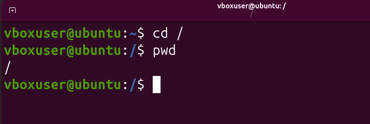

---

# 📍 1. `pwd` — Print Working Directory

```bash
pwd
```

`pwd` stands for **Print Working Directory**.

It tells us the exact directory in which the terminal is currently working.

### Example

```bash
pwd
```

Possible output:

```text
/home/user
```

### Why is this important?

Before performing a file operation, it is useful to know **where you currently are**.

A good Linux habit is:

```text
Where am I?
     ↓
pwd
     ↓
Perform the operation
```

### 🔐 Cybersecurity Connection

When working with logs, scripts, configuration files, evidence, or security tools, knowing your current location helps prevent operating on the wrong files.

### 📸 Practical Evidence

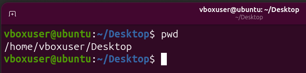

---

# 📋 2. `ls` — List Files and Directories

```bash
ls
```

`ls` displays the files and directories in the current location.

### Example

```bash
ls
```

Possible output:

```text
Documents
Downloads
notes.txt
project
```

### 🔐 Cybersecurity Connection

Listing directory contents is one of the most basic forms of **system and filesystem enumeration**.

### 📸 Practical Evidence

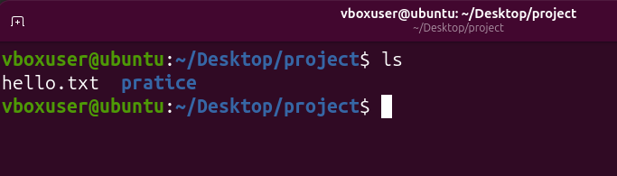

---

# 🔎 3. `ls -a` — Show Hidden Files

```bash
ls -a
```

The `-a` option means **all**.

It displays normal files as well as hidden files.

Linux commonly treats filenames beginning with `.` as hidden.

Example:

```text
.
..
.bashrc
.profile
notes.txt
```

### 📸 Practical Evidence

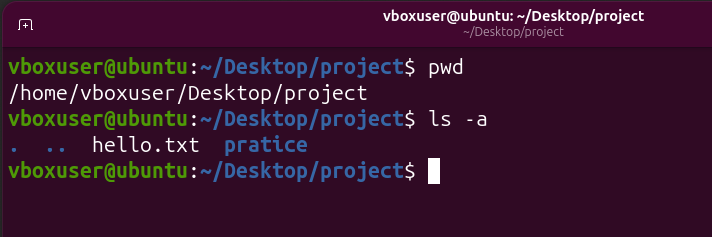

---

# 📑 4. `ls -l` — Long Listing

```bash
ls -l
```

The `-l` option provides a detailed listing.

It can show information such as:

* File type
* Permissions
* Number of links
* Owner
* Group
* File size
* Modification time
* Filename

Example:

```text
-rw-r--r-- 1 user user 120 Sep 15 notes.txt
```

### 🔐 Cybersecurity Connection

Detailed listings become especially important when learning:

* Linux permissions
* File ownership
* Access control
* Timestamps
* Security investigations

### 📸 Practical Evidence

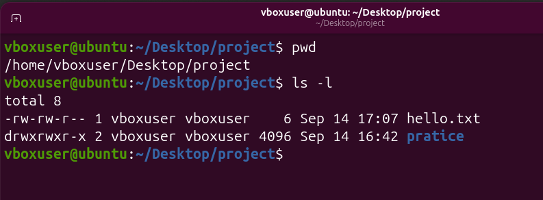

---

# 🔐 5. `ls -la` — Detailed Listing Including Hidden Files

```bash
ls -la
```

This combines:

```text
-l → long/detailed listing
-a → show hidden files
```

Therefore:

```bash
ls -la
```

shows detailed information for both normal and hidden files.

### 📸 Practical Evidence

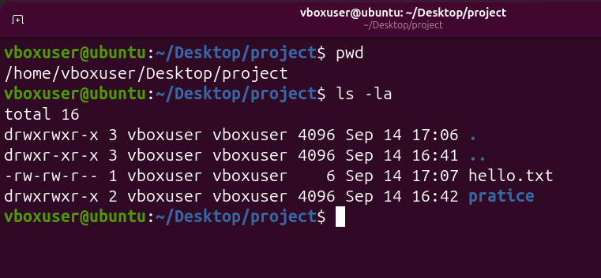

---

# 📁 6. `ls -l directory` — Inspect a Specific Directory

Instead of listing the current directory, `ls -l` can be given a directory path.

```bash
ls -l directory
```

This allows us to inspect the contents of a specific directory without first entering it.

### 📸 Practical Evidence

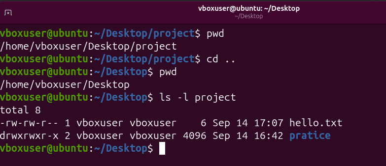

---

# 🔄 7. `ls -R` — Recursive Listing

```bash
ls -R
```

The `-R` option means **recursive**.

It lists the contents of the current directory and continues into its subdirectories.

Conceptually:

```text
project/
├── file.txt
├── docs/
│   ├── notes.txt
│   └── report.txt
└── scripts/
    └── test.sh
```

A recursive listing allows you to inspect the directory tree.

### 🔐 Cybersecurity Connection

Recursive inspection is useful when exploring unfamiliar directory structures during system analysis.

### 📸 Practical Evidence

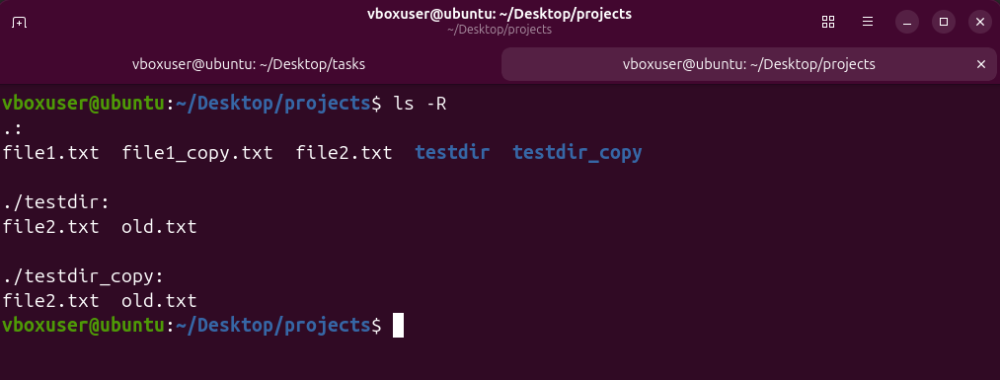

---

# 🔃 8. `ls -r` — Reverse Listing Order

```bash
ls -r
```

The `-r` option displays the listing in reverse order.

### Important distinction

Do not confuse:

```text
-R → recursive
-r → reverse order
```

The uppercase/lowercase difference matters.

### 📸 Practical Evidence

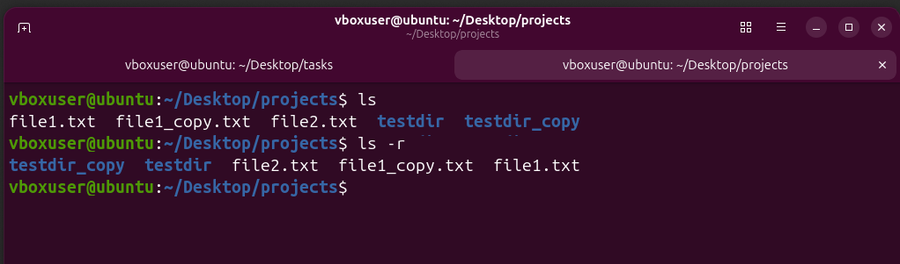

---

# 🚶 9. `cd` — Change Directory

```bash
cd directory
```

`cd` stands for **Change Directory**.

It is used to move from one directory to another.

### Example

```bash
cd Documents
```

This moves into the `Documents` directory.

### 📸 Practical Evidence

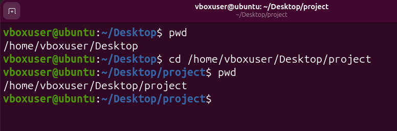

---

# 🏠 10. `cd ~` — Go to Home Directory

```bash
cd ~
```

The `~` symbol represents the current user's home directory.

For example:

```text
/home/user
```

You can also simply use:

```bash
cd
```

to return to the home directory.

### 📸 Practical Evidence


---

# ⬆️ 11. `cd ..` — Go to Parent Directory

```bash
cd ..
```

The special path:

```text
..
```

means the **parent directory**.

Example:

```text
/home/user/Documents
```

Running:

```bash
cd ..
```

moves to:

```text
/home/user
```

### 📸 Practical Evidence


---

# 🧭 12. Absolute Paths

An **absolute path** starts from the root directory:

```text
/
```

Example:

```bash
cd /home/user/Documents
```

The complete location is specified.

```text
/
└── home
    └── user
        └── Documents
```

An absolute path does not depend on where you currently are.

### 📸 Practical Evidence

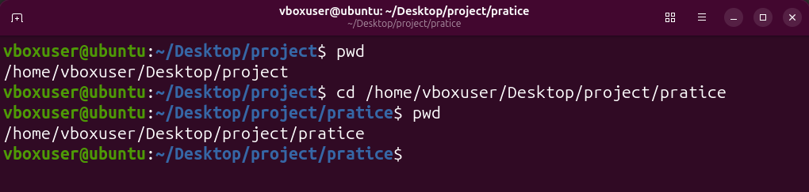

---

# 🧭 13. Relative Paths

A **relative path** starts from the current working directory.

Example:

```bash
cd Documents
```

This means:

> Go to `Documents` from my current location.

### Absolute vs Relative

| Type     | Example                | Starts From       |
| -------- | ---------------------- | ----------------- |
| Absolute | `/home/user/Documents` | Root `/`          |
| Relative | `Documents`            | Current directory |

### 🔐 Cybersecurity Connection

Understanding paths is essential when working with:

* Security tools
* Scripts
* Configuration files
* Logs
* Evidence
* Exploit labs
* File permissions

### 📸 Practical Evidence

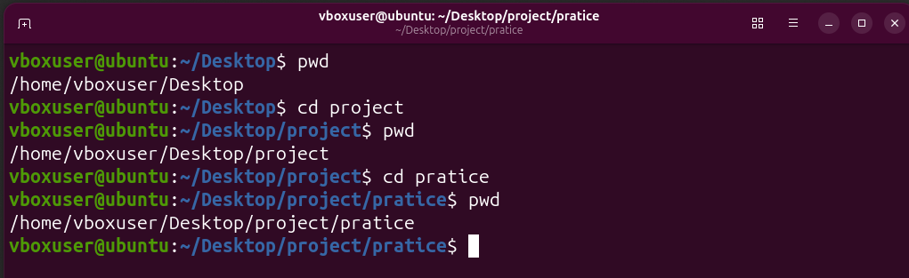

---

# 📁 14. `mkdir` — Create a Directory

```bash
mkdir directory_name
```

`mkdir` stands for **make directory**.

Example:

```bash
mkdir cybersecurity
```

creates:

```text
cybersecurity/
```

### 📸 Practical Evidence

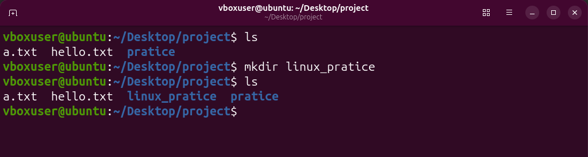

---

# 📄 15. `touch` — Create a File

```bash
touch file.txt
```

Creates an empty file if the file does not already exist.

Example:

```bash
touch notes.txt
```

### Important

`touch` can also update the timestamps of an existing file.

### 📸 Practical Evidence

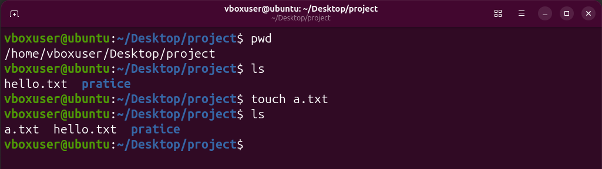

---

# 💬 16. `echo` — Display Text

```bash
echo "Hello Linux"
```

`echo` displays text in the terminal.

Example:

```bash
echo "Linux Fundamentals"
```

Output:

```text
Linux Fundamentals
```

It can also be combined with redirection to place text into a file.

### 📸 Practical Evidence

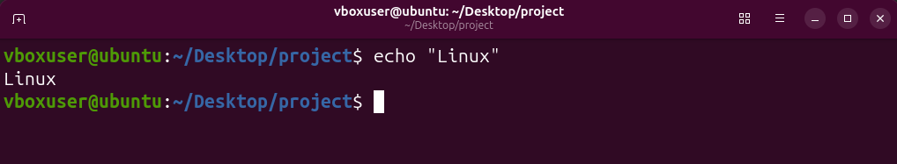

---

# 👻 17. `echo` — Working with Hidden Files

Linux hidden filenames normally begin with a dot:

```text
.secret
.config
.bashrc
```

For example:

```bash
echo "secret information" > .hidden.txt
```

The file begins with `.` and therefore does not normally appear with a simple:

```bash
ls
```

It can be viewed using:

```bash
ls -a
```

### 🔐 Cybersecurity Connection

Hidden files are important during filesystem enumeration because a normal directory listing may not reveal everything present.

### 📸 Practical Evidence

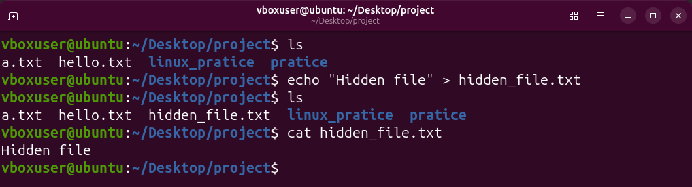

---

# 🏠 18. `echo` — Working with the Home Directory

The `~` symbol represents the current user's home directory.

For example:

```bash
echo "Linux notes" > ~/notes.txt
```

This places the file inside the user's home directory.

### 📸 Practical Evidence

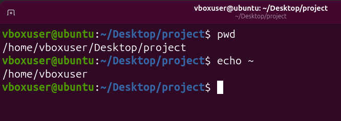

---

# ➡️ 19. Output Redirection — `>`

The `>` operator redirects command output into a file.

Example:

```bash
echo "Linux Fundamentals" > notes.txt
```

If `notes.txt` does not exist, it is created.

If it already exists, its previous contents are **overwritten**.

### Example

```bash
echo "First line" > notes.txt
```

Then:

```bash
echo "Second line" > notes.txt
```

The file contains:

```text
Second line
```

### ⚠️ Important

Remember:

```text
>  → overwrite
```

Be careful when redirecting output to an existing file.

### 📸 Practical Evidence

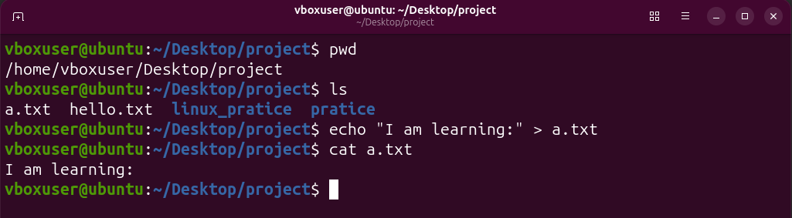

---

# ➕ 20. Append Output — `>>`

The `>>` operator appends output to the end of an existing file.

Example:

```bash
echo "First line" > notes.txt
echo "Second line" >> notes.txt
```

The result is:

```text
First line
Second line
```

### Remember

```text
>   → overwrite
>>  → append
```

### 🔐 Cybersecurity Connection

Understanding append operations is useful when working with logs and other files where existing information must be preserved.

### 📸 Practical Evidence

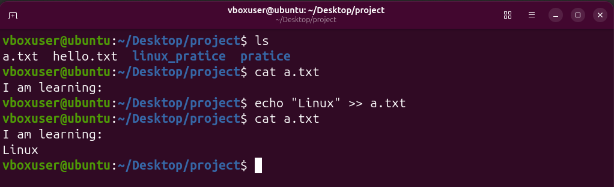

---

# 📋 21. `cp` — Copy File to File

The basic syntax is:

```bash
cp source destination
```

Example:

```bash
cp file1.txt file2.txt
```

This creates a copy of `file1.txt` named `file2.txt`.

The original file remains.

### 📸 Practical Evidence

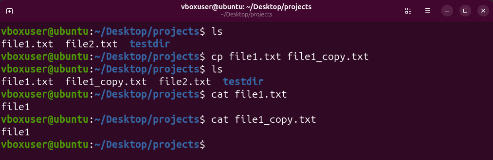

---

# 📂 22. `cp` — Copy File to Directory

A file can be copied into a directory:

```bash
cp file.txt Documents/
```

The original file remains in its original location.

### 📸 Practical Evidence

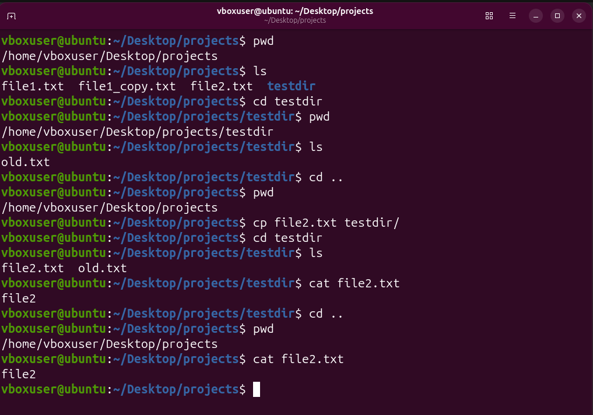

---

# 📁 23. `cp -r` — Copy Directory to Directory

To copy a directory and its contents, use the recursive option:

```bash
cp -r directory1 directory2
```

Example:

```bash
cp -r project backup
```

Here:

```text
-r → recursive
```

It allows `cp` to copy directories and the files inside them.

### 📸 Practical Evidence

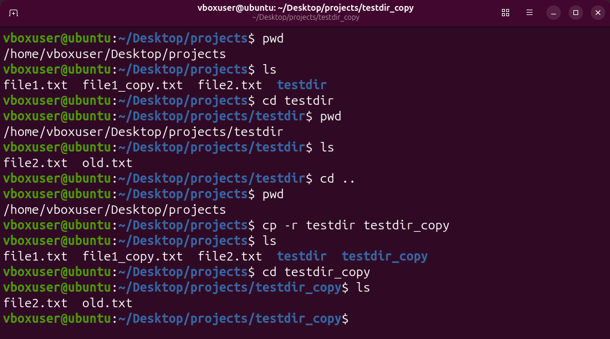

---

# 🚚 24. `mv` — Move a File

```bash
mv source destination
```

The `mv` command moves a file or directory.

Example:

```bash
mv file.txt Documents/
```

The file is moved from its original location into `Documents`.

### 📸 Practical Evidence

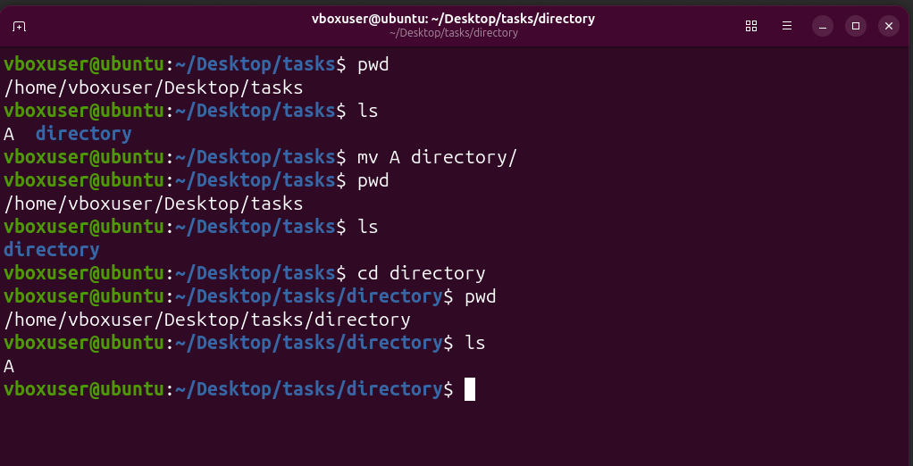

---

# 🚚✏️ 25. `mv` — Move and Rename

`mv` can also move a file while changing its name.

Example:

```bash
mv file.txt Documents/new-file.txt
```

The file is:

1. Moved to another directory
2. Renamed at the same time

### 📸 Practical Evidence

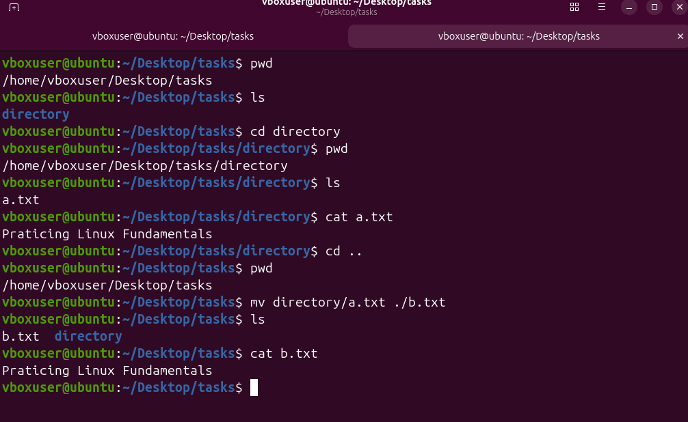

---

# ✏️ 26. `mv` — Rename a File

`mv` can rename a file without moving it to another directory.

```bash
mv oldname.txt newname.txt
```

The contents remain the same; the filename changes.

### Important

Linux does not need a separate `rename` command for this basic operation.

### 📸 Practical Evidence

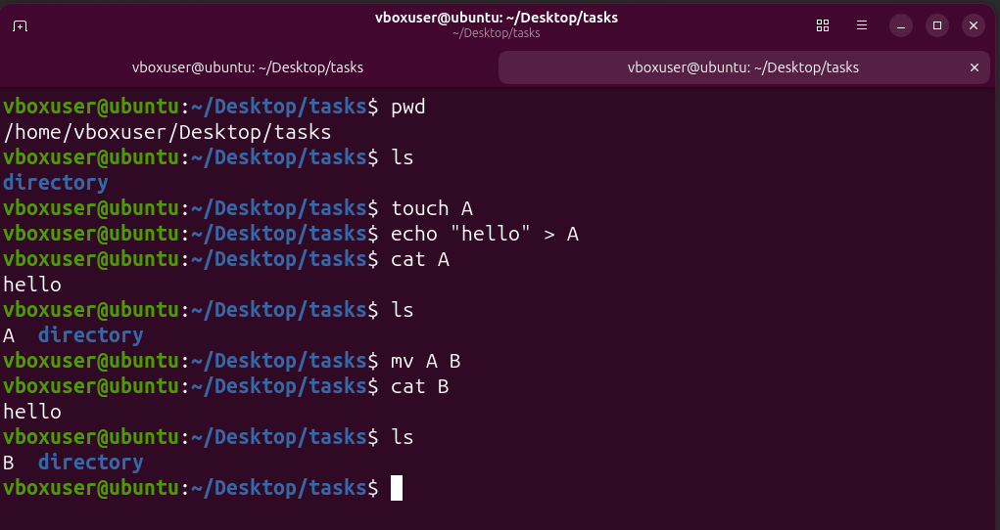

---

# 🗑️ 27. `rm` — Remove a File

```bash
rm filename
```

`rm` removes a file.

Example:

```bash
rm file.txt
```

### ⚠️ Important

Command-line `rm` normally does **not** move a file to a recycle bin.

Therefore, always check:

```bash
pwd
ls
```

before performing destructive operations.

### 🔐 Cybersecurity Connection

Understanding file deletion is important in system administration, security labs, incident response, and forensic analysis.

### 📸 Practical Evidence

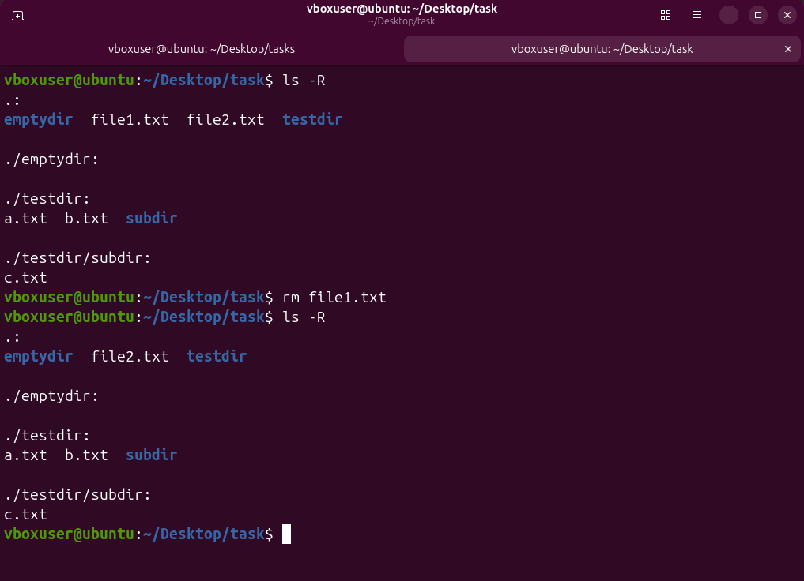

---

# 🗑️ 28. `rm -r` — Remove a Directory Recursively

```bash
rm -r directory
```

The `-r` option means **recursive**.

It allows `rm` to remove a directory along with its contents.

Example:

```bash
rm -r old_project
```

### ⚠️ Warning

Recursive deletion can remove multiple files.

Always verify the target before running the command.

### 📸 Practical Evidence

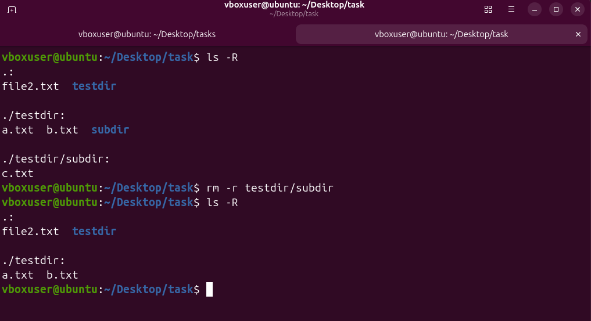

---

# 🚨 29. `rm -rf` — Force Recursive Removal

```bash
rm -rf directory
```

Here:

```text
-r → recursive
-f → force
```

This can remove a directory and its contents without interactive confirmation.

### ⚠️ Critical Safety Rule

Never run destructive commands blindly.

Before using:

```bash
rm -rf
```

verify:

```bash
pwd
ls
```

and make sure the target is exactly what you intend to remove.

Avoid experimenting with destructive commands on important system directories.

### 📸 Practical Evidence

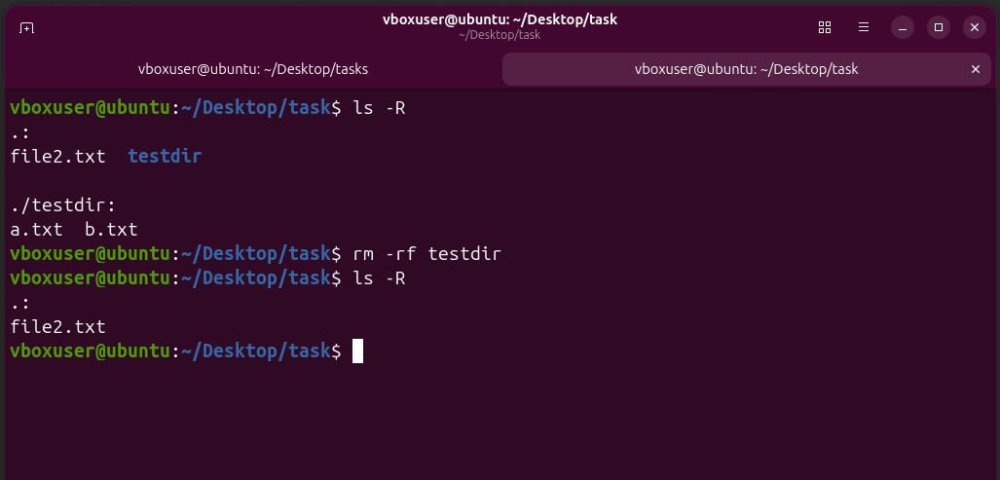

---

# 📂 30. `rmdir` — Remove an Empty Directory

```bash
rmdir directory
```

`rmdir` removes an **empty directory**.

Example:

```bash
rmdir old_folder
```

If the directory contains files, `rmdir` normally refuses to remove it.

### Difference

```text
rmdir directory
    ↓
Only empty directories

rm -r directory
    ↓
Directory + contents
```

### 📸 Practical Evidence

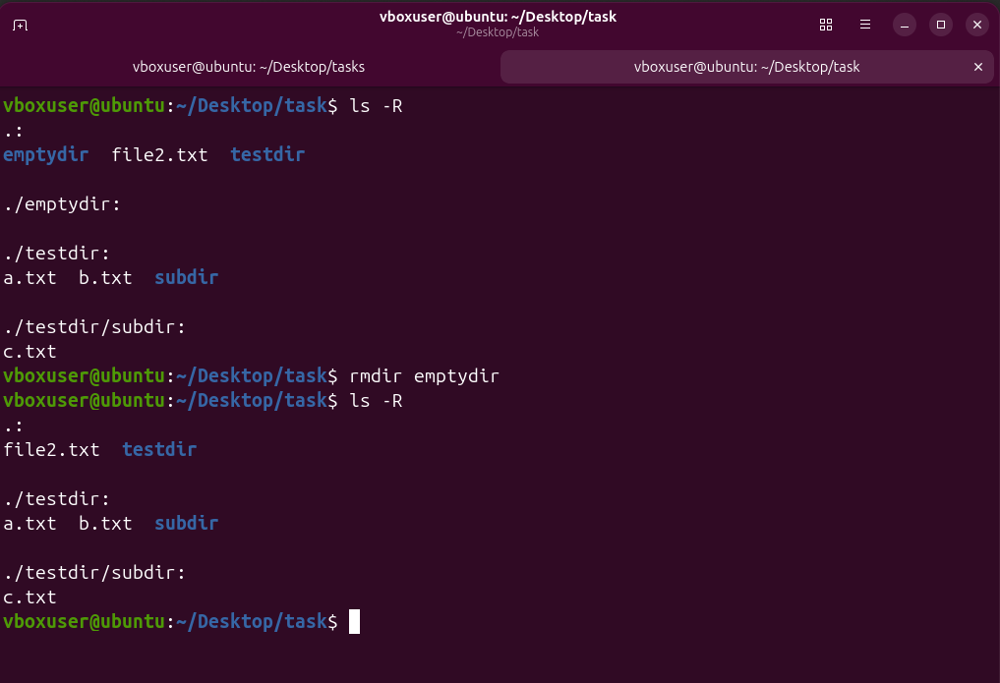

---

# 🧠 Linux Path Symbols

These three symbols are fundamental:

| Symbol | Meaning                       |
| ------ | ----------------------------- |
| `/`    | Root directory                |
| `.`    | Current directory             |
| `..`   | Parent directory              |
| `~`    | Current user's home directory |

Example:

```bash
cd ..
```

Move one level up.

```bash
cd .
```

Refer to the current directory.

```bash
cd ~
```

Go to the user's home directory.

---

# 🧩 Command Summary

| Command  | Purpose                                 |
| -------- | --------------------------------------- |
| `pwd`    | Show current working directory          |
| `ls`     | List files and directories              |
| `ls -a`  | Show hidden files                       |
| `ls -l`  | Detailed listing                        |
| `ls -la` | Detailed listing including hidden files |
| `ls -R`  | Recursive listing                       |
| `ls -r`  | Reverse listing order                   |
| `cd`     | Change directory / go home              |
| `cd ~`   | Go to home directory                    |
| `cd ..`  | Go to parent directory                  |
| `mkdir`  | Create directory                        |
| `touch`  | Create file / update timestamps         |
| `echo`   | Display text                            |
| `cp`     | Copy files                              |
| `cp -r`  | Copy directories recursively            |
| `mv`     | Move or rename                          |
| `rm`     | Remove file                             |
| `rm -r`  | Remove directory recursively            |
| `rm -rf` | Force recursive removal                 |
| `rmdir`  | Remove empty directory                  |
| `>`      | Redirect and overwrite                  |
| `>>`     | Redirect and append                     |

---

# 🔐 Cybersecurity Connection

These commands may look simple, but they form part of the foundation required for practical cybersecurity work.

A simplified workflow looks like:

```text
Target System
      ↓
Navigate filesystem
      ↓
Identify directories
      ↓
Find files
      ↓
Inspect information
      ↓
Read / copy / analyze files
      ↓
Modify or move files when authorized
      ↓
Understand system environment
```

For example:

```bash
pwd
ls -la
```

can help establish:

* Where you are
* What files are present
* Whether hidden files exist
* Basic file ownership and permissions

Later, these fundamentals connect to commands and concepts such as:

```text
find
grep
cat
less
stat
chmod
chown
ps
ss
```

and eventually to:

* Linux administration
* System enumeration
* Log analysis
* Incident response
* Digital forensics
* Security automation
* Penetration testing

---

# 🧪 Practical Lab Workflow

The exercises in this lab can be understood as one continuous workflow:

```text
1. Find my location
        ↓
      pwd
        ↓
2. See what is there
        ↓
       ls
        ↓
3. Navigate
        ↓
       cd
        ↓
4. Create directories
        ↓
      mkdir
        ↓
5. Create files
        ↓
      touch
        ↓
6. Add information
        ↓
      echo
        ↓
7. Copy
        ↓
       cp
        ↓
8. Move / rename
        ↓
       mv
        ↓
9. Remove
        ↓
       rm
```

This progression helped me understand Linux as a **filesystem that I can navigate and manipulate through the command line**.

---

# 🧪 Practice Checklist

### Navigation

* [x] `pwd`
* [x] `ls`
* [x] `cd`
* [x] `cd ~`
* [x] `cd ..`
* [x] Absolute paths
* [x] Relative paths

### Listing

* [x] `ls -a`
* [x] `ls -l`
* [x] `ls -la`
* [x] `ls -R`
* [x] `ls -r`

### Creating

* [x] `mkdir`
* [x] `touch`
* [x] `echo`

### Copying / Moving

* [x] `cp` file → file
* [x] `cp` file → directory
* [x] `cp -r` directory → directory
* [x] `mv` move
* [x] `mv` move + rename
* [x] `mv` rename

### Deleting

* [x] `rm`
* [x] `rm -r`
* [x] `rm -rf`
* [x] `rmdir`

### Output

* [x] `>`
* [x] `>>`

### Filesystem

* [x] Linux root filesystem
* [x] Hidden files
* [x] Home directory
* [x] Parent/current directory concepts

---

# 📸 Practical Evidence

Every major command demonstrated in this lab has corresponding terminal evidence stored in the `Screenshots/` directory.

The screenshots are intentionally placed **next to the relevant command/topic in this README**, allowing a reader to connect:

```text
Concept
   ↓
Command
   ↓
Explanation
   ↓
Actual Terminal Practice
```

This makes the documentation both **beginner-friendly and evidence-based**.

---

# 📁 Repository Structure

```text
Lab-03-Basic-Files-Operations/
│
├── README.md
│
└── Screenshots/
    │
    ├── cd-absolute-path-command.png
    ├── cd-command.png
    ├── cd-current-directory.png
    ├── cd-home-command.png.png
    ├── cd-parent-command.png.png
    ├── cd-relative-path-command.png
    │
    ├── cp-directory-to-directory-command.png
    ├── cp-file-to-directory-command.png
    ├── cp-file-to-file-command.png
    │
    ├── echo-append-command.png
    ├── echo-command.png
    ├── echo-hidden-file-command.png
    ├── echo-home-command.png
    │
    ├── ls-all-command.png
    ├── ls-command.png
    ├── ls-long-all-command.png
    ├── ls-long-command.png
    ├── ls-long-directory-command.png
    ├── ls-recursive-command.png
    ├── ls-reverse-command.png
    │
    ├── mkdir-command.png
    │
    ├── mv-move-command.png.png
    ├── mv-move-rename-command.png
    ├── mv-rename-command.png.png
    │
    ├── print-working-directory.png
    ├── redirect-overwrite.png
    │
    ├── rm-command.png
    ├── rm-force-recursive-command.png
    ├── rm-recursive-command.png
    │
    ├── rmdir-empty-directory-command.png
    ├── root-filesystem.png
    └── touch-command.png
```

> **Note:** The filenames above match the screenshot names provided for this lab. If a filename contains `.png.png`, it should remain that way unless you rename the actual file in the repository.

---

# 🧠 What I Learned

The biggest lesson from this lab is that Linux commands are not isolated commands to memorize.

They work together around a simple model:

```text
Filesystem
    ↓
Directories
    ↓
Paths
    ↓
Files
    ↓
Commands
    ↓
File Operations
```

For example:

```bash
pwd
```

answers:

> **Where am I?**

```bash
ls
```

answers:

> **What is here?**

```bash
cd
```

answers:

> **How do I move somewhere else?**

```bash
mkdir
touch
```

answer:

> **How do I create things?**

```bash
cp
mv
```

answer:

> **How do I copy, move, or rename things?**

```bash
rm
rmdir
```

answer:

> **How do I remove things?**

Understanding this relationship is more valuable than simply memorizing syntax.

---

# 🛡️ Safety Lessons

Some Linux commands can be destructive.

The most important safety habit learned from this lab is:

```bash
pwd
ls
```

**before destructive operations.**

Especially be careful with:

```bash
rm
rm -r
rm -rf
```

A command-line shell generally does not provide the same safety net as a graphical recycle bin.

### Rule:

> **Understand the command → verify the target → execute.**

This habit is especially important in cybersecurity, where commands may be executed on real systems and valuable data may be involved.

---

# 🚀 Next Learning Path

This lab provides the foundation for the next Linux topics:

```text
Basic File Operations
        ↓
File Contents & Text Processing
        ↓
Permissions & Ownership
        ↓
Users & Groups
        ↓
Processes
        ↓
Networking
        ↓
Shell & Bash
        ↓
System Administration
        ↓
Linux Security
        ↓
Cybersecurity
```

The goal is to become comfortable enough with Linux that the terminal becomes a **working environment**, not something that has to be memorized command-by-command.

---

# 🏁 Key Takeaways

> **`pwd`** → Know where you are.

> **`ls`** → Know what is there.

> **`cd`** → Navigate.

> **`mkdir`** → Create directories.

> **`touch`** → Create files.

> **`echo`** → Display or generate text.

> **`cp`** → Copy.

> **`mv`** → Move or rename.

> **`rm`** → Remove.

> **`rmdir`** → Remove an empty directory.

> **`>`** → Overwrite.

> **`>>`** → Append.

> **`.`** → Current directory.

> **`..`** → Parent directory.

> **`~`** → User's home directory.

> **`/`** → Root of the filesystem.

---

# 📌 Learning Philosophy

This repository documents my **hands-on Linux and cybersecurity learning journey**.

My approach is:

```text
Learn
  ↓
Understand
  ↓
Practice
  ↓
Document
  ↓
Verify with Evidence
  ↓
Apply to Cybersecurity
```

The objective is not to collect commands.

The objective is to develop **real Linux fundamentals that can later support cybersecurity skills such as enumeration, system administration, scripting, security analysis, and penetration testing**.

---

## ✅ Lab Status

**Status:** Completed ✅

**Focus Areas:**

* Linux Fundamentals
* Command-Line Navigation
* Filesystem Structure
* Files & Directories
* Absolute & Relative Paths
* File Management
* Output Redirection
* Hidden Files
* Practical Terminal Skills
* Cybersecurity Foundations

**Evidence:** 32 hands-on terminal screenshots 📸

---

> 🐧 **Foundation first. Security next.**

> *Every cybersecurity journey becomes stronger when the underlying Linux fundamentals are understood properly.*
