# 🐧 Lab 04 — Files and Directories

# 🔐 Project: Linux-Cybersecurity-Evidence-Management-Project

> **A beginner cybersecurity project demonstrating Linux file and directory management through a simulated evidence-handling workflow.**
>**This lab focuses on understanding how Linux manages **files and directories**.
>Instead of only practicing commands individually, I applied them in a small **cybersecurity-themed project**.


# 🎯 Project Objective

The goal of this project was to simulate a beginner security analyst organizing and managing investigation evidence inside a Linux environment.

The project demonstrates:

* Creating a structured investigation workspace
* Creating simulated evidence files
* Recording investigation observations
* Organizing evidence
* Creating a backup
* Renaming a backup
* Moving a temporary file
* Performing controlled cleanup
* Verifying the final directory structure

> ⚠️ **Important:** This is a simulated cybersecurity project created for learning Linux and basic security workflow concepts. The evidence is not from a real investigation.

---

# 🧩 Scenario

Imagine that a security analyst has collected some simulated authentication and system information from a Linux machine.

The analyst needs to:

1. Create an investigation workspace.
2. Store evidence files.
3. Record suspicious activity observations.
4. Create investigation notes.
5. Create a backup before making further changes.
6. Rename the backup for version identification.
7. Move a temporary file into an archive.
8. Remove the temporary file through controlled cleanup.
9. Verify the final project structure.

This project uses basic Linux file-management commands to model that workflow.

---

# 📁 Project Structure

```text
Linux-Cybersecurity-Evidence-Management-Project/
│
├── evidence/
│   ├── auth.log
│   ├── suspicious_activity.txt
│   └── system_info.txt
│
├── notes/
│   └── investigation_notes.txt
│
└── archive/
```

A backup was also created:

```text
Linux-Cybersecurity-Evidence-Management-backup-v1/
```

---

# 🛠️ Step-by-Step Workflow

## 01 — Create Investigation Workspace

Created the main project directory and organized it into three working areas:

```bash
mkdir -p ~/Linux-Cybersecurity-Evidence-Management-Project
cd ~/Linux-Cybersecurity-Evidence-Management-Project

mkdir -p evidence
mkdir -p notes
mkdir -p archive

ls -l
pwd
```

### Why?

A structured directory makes evidence easier to organize and manage.

---

## 02 — Create Simulated Evidence Files

Created three files inside the `evidence` directory:

```bash
touch evidence/auth.log
touch evidence/suspicious_activity.txt
touch evidence/system_info.txt

ls -l evidence
```

The files represent different types of investigation information.

| File                      | Purpose                         |
| ------------------------- | ------------------------------- |
| `auth.log`                | Simulated authentication events |
| `suspicious_activity.txt` | Investigation observation       |
| `system_info.txt`         | System information              |

---

## 03 — Add Evidence Information

### `auth.log`

```text
[2026-09-15 09:14:22] LOGIN SUCCESS - user: analyst
[2026-09-15 09:18:41] LOGIN FAILED - user: unknown
[2026-09-15 09:18:45] LOGIN FAILED - user: unknown
[2026-09-15 09:19:03] LOGIN FAILED - user: unknown
[2026-09-15 09:25:11] LOGIN SUCCESS - user: analyst
```

### `suspicious_activity.txt`

```text
Suspicious Activity Report

Observation:
Multiple failed login attempts were observed within a short period.

Possible interpretation:
The activity may indicate a password-guessing attempt.

Status:
Requires further investigation.
```

### `system_info.txt`

System information was collected from the Ubuntu VM using:

```bash
whoami
hostname
uname -a
```

The output was recorded inside the evidence file.

### Verification

```bash
cat evidence/auth.log
cat evidence/suspicious_activity.txt
cat evidence/system_info.txt
```

---

# 📝 04 — Create Investigation Notes

Created a separate notes file:

```bash
nano notes/investigation_notes.txt
```

The notes contained:

```text
Investigation Notes

1. Multiple failed login attempts were observed.
2. The failed attempts occurred within a short time period.
3. The activity may require further investigation.
4. Evidence files were organized inside the evidence directory.
5. A backup will be created before further changes.
```

Verified the notes with:

```bash
cat notes/investigation_notes.txt
```

---

# 💾 05 — Create Evidence Backup

Before further changes, the project directory was copied recursively:

```bash
cd ~

cp -r Linux-Cybersecurity-Evidence-Management-Project \
Linux-Cybersecurity-Evidence-Management-backup

ls -ld Linux-Cybersecurity-Evidence-Management*
```

### Key concept

`cp -r` is required when copying a directory together with its contents.

The original project remains unchanged.

---

# ✏️ 06 — Rename the Backup

The backup was renamed using `mv`:

```bash
mv ~/Linux-Cybersecurity-Evidence-Management-backup \
~/Linux-Cybersecurity-Evidence-Management-backup-v1

ls -ld ~/Linux-Cybersecurity-Evidence-Management*
```

### Key concept

`mv` can be used for both:

* Moving files/directories
* Renaming files/directories

Unlike `cp`, `mv` does not require `-r` for directories.

---

# 📦 07 — Move a Temporary File

Created a temporary file:

```bash
cd ~/Linux-Cybersecurity-Evidence-Management-Project

touch temporary_note.txt
ls -l
```

Then moved it into the archive directory:

```bash
mv temporary_note.txt archive/
ls -l archive
```

### Key concept

The file was moved rather than copied.

After the `mv` operation, the original location no longer contained the file.

---

# 🗑️ 08 — Controlled Cleanup

The temporary file was removed:

```bash
rm archive/temporary_note.txt
ls -l archive
```

### Important Linux Concept

`rm` normally removes files directly rather than sending them to the graphical Trash.

Therefore:

> **Always verify the target before using `rm`.**

For safer interactive deletion:

```bash
rm -i
```

For directories:

```bash
rm -r
```

`rm -rf` was intentionally avoided because it can perform forceful recursive deletion and should not be used casually.

---

# 🔍 09 — Final Verification

The final project was verified using:

```bash
cd ~/Linux-Cybersecurity-Evidence-Management-Project

ls -l
ls -l evidence
ls -l notes
ls -l archive

cd ~

ls -ld Linux-Cybersecurity-Evidence-Management*
```

The verification confirmed:

* Evidence directory exists
* Evidence files exist
* Investigation notes exist
* Archive is empty after cleanup
* Backup exists
* Backup has been renamed to version `v1`

---

# 🧠 Linux Concepts Demonstrated

| Command    | What I Practiced                 |
| ---------- | -------------------------------- |
| `mkdir`    | Creating directories             |
| `mkdir -p` | Creating directory paths         |
| `touch`    | Creating files                   |
| `ls`       | Listing directory contents       |
| `ls -l`    | Detailed file information        |
| `cp`       | Copying files                    |
| `cp -r`    | Copying directories recursively  |
| `mv`       | Moving files                     |
| `mv`       | Renaming files/directories       |
| `rm`       | Removing files                   |
| `rm -r`    | Removing directories recursively |
| `rm -i`    | Interactive deletion             |
| `rmdir`    | Removing empty directories       |
| `cat`      | Viewing file contents            |

---

# 🔐 Cybersecurity Relevance

Although this project uses basic Linux commands, these concepts are important for cybersecurity work.

### Evidence Organization

Security analysts frequently work with files containing:

* Logs
* System information
* Investigation notes
* Reports
* Collected evidence

A clear directory structure helps prevent confusion.

### Backup Awareness

Creating a backup before modifying data demonstrates an important operational habit:

> **Preserve information before making changes.**

### Controlled File Operations

Commands such as:

```bash
cp
mv
rm
```

can modify or delete important information.

Understanding exactly what each command does is therefore important when working with security-related data.

### Verification

Running `ls -l`, `cat`, and other verification commands helps confirm that the intended operation actually occurred.

---

# ⚠️ Important Safety Lessons

Linux file-management commands can be powerful.

### Be especially careful with:

```bash
rm
rm -r
rm -rf
```

Before deleting anything:

1. Check your current directory with `pwd`.
2. Check the target with `ls`.
3. Confirm the filename/path.
4. Delete only what you intend to remove.

A useful principle:

> **Understand the command before executing it.**

---

# 📸 Screenshots / Evidence

The following screenshots document the actual Ubuntu project workflow.

## 01 — Workspace Created

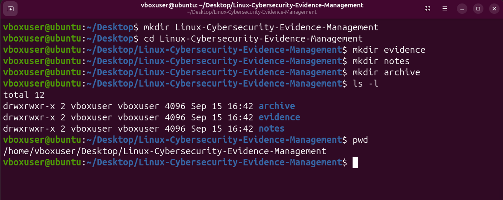

---

## 02 — Evidence Files Created

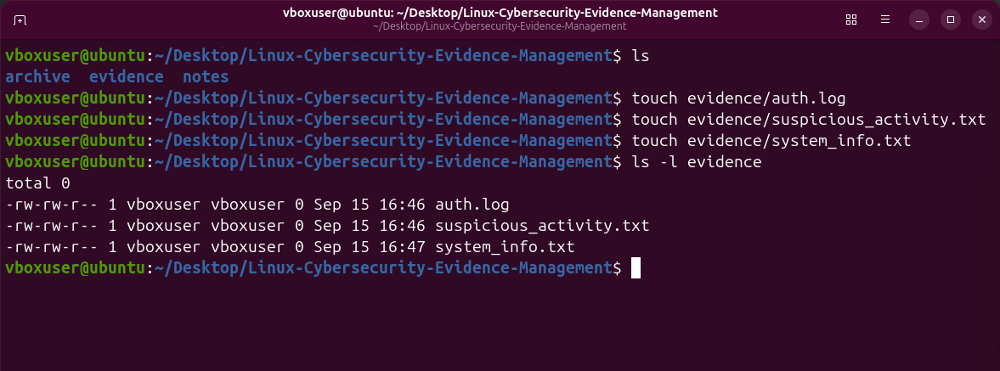

---

## 03 — Evidence Content

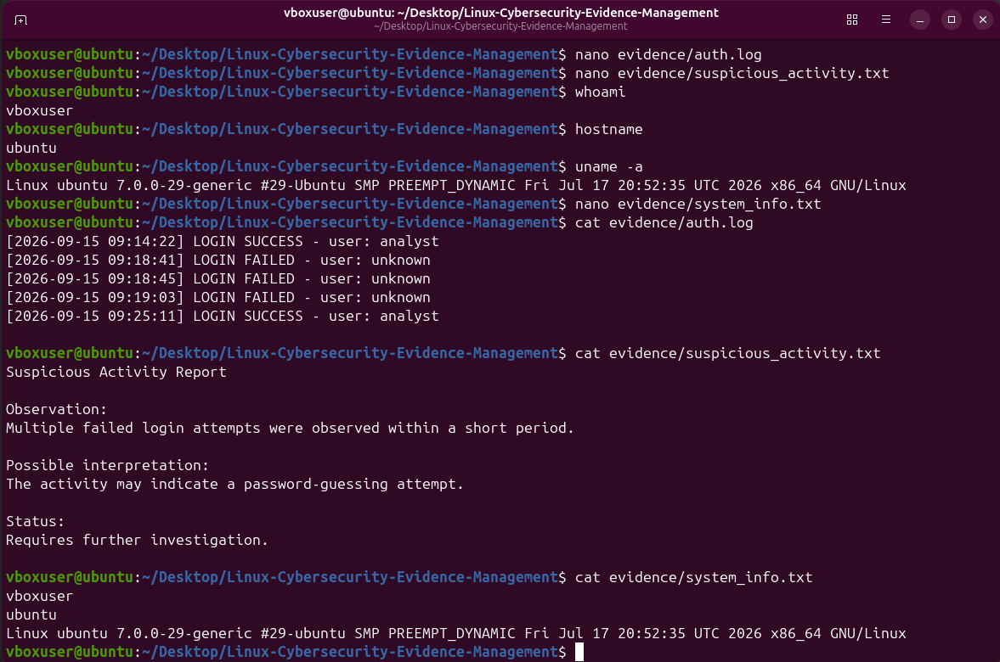

---

## 04 — Investigation Notes

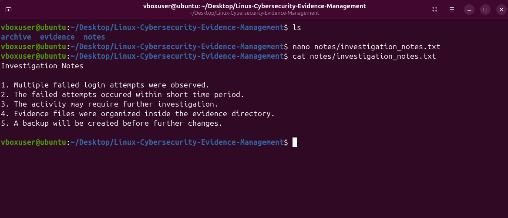

---

## 05 — Backup Created

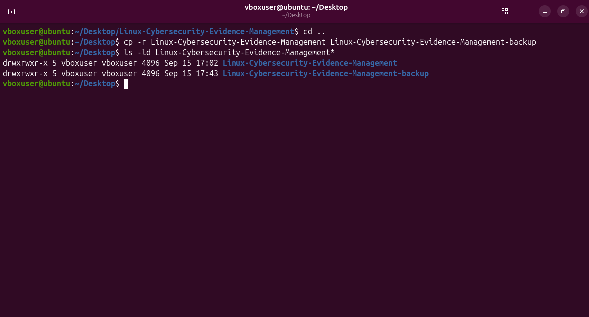

---

## 06 — Backup Renamed

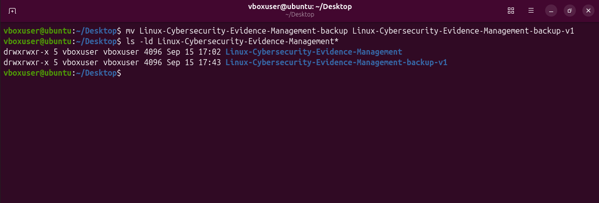

---

## 07 — File Moved

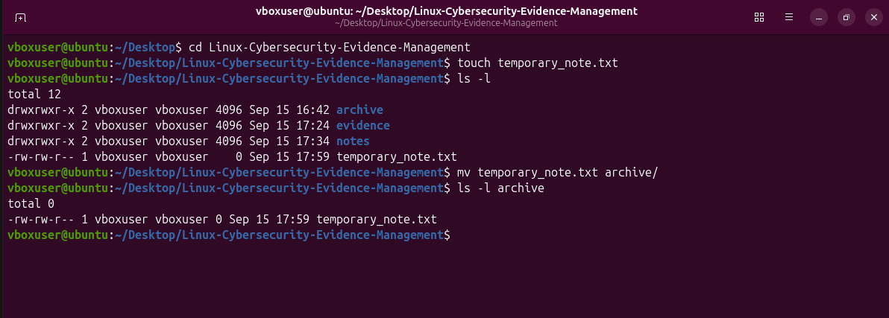

---

## 08 — Controlled Cleanup

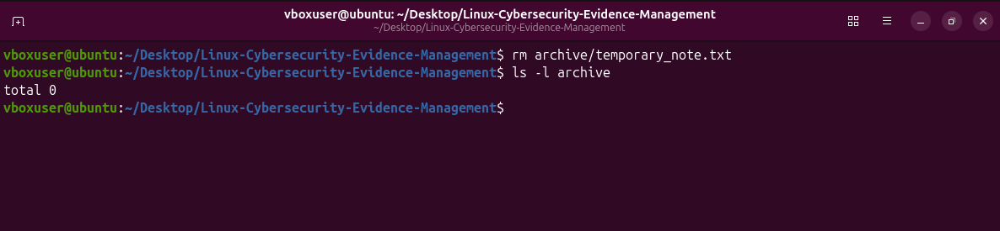

---

## 09 — Final Project Verification

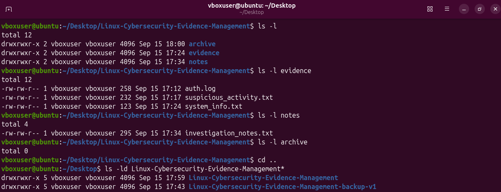

---

## 9A — Evidence Project Tree

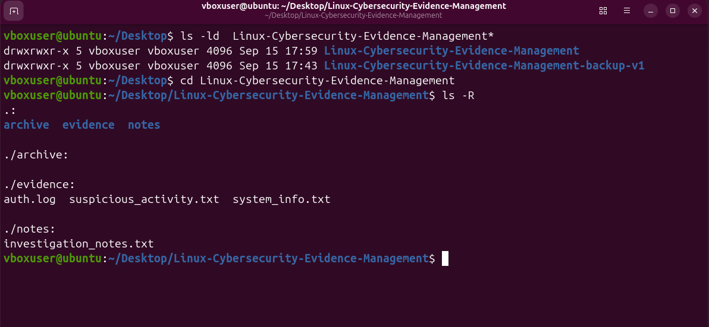

---

## 9B — Backup Project Tree

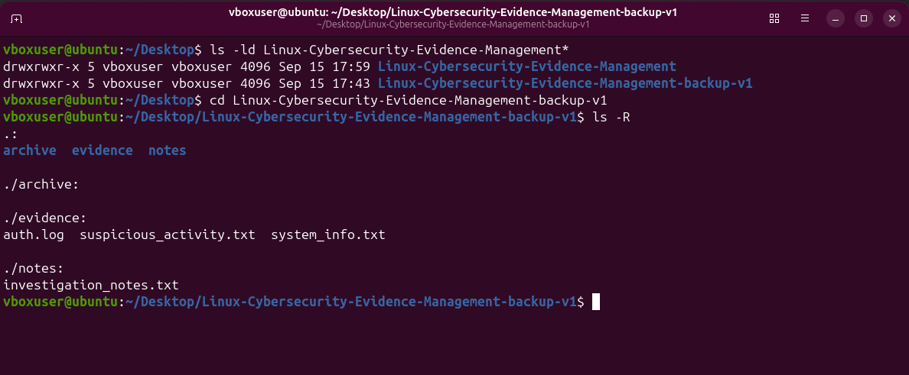

---

# 📂 Final Repository Structure

```text
Lab-04-Files-and-Directories/
│
├── README.md
│
├── screenshots/
│   ├── 01-workspace-created.png
│   ├── 02-evidence-files-created.png
│   ├── 03-evidence-content.png
│   ├── 04-investigation-notes.png
│   ├── 05-backup-created.png
│   ├── 06-backup-renamed.png
│   ├── 07-file-moved.png
│   ├── 08-controlled-cleanup.png
│   ├── 09-final-project.png
│   ├── 9a-evidencetree.png
│   └── 9b-evidence-backup-v1-tree.png
│
└── project/
    └── Linux-Cybersecurity-Evidence-Management-Project/
```

---

# 🎓 What I Learned

Through this lab and project, I learned that Linux file management is not simply about memorizing commands.

I learned to understand:

* Where I am in the filesystem
* How files and directories are structured
* How to create and organize files
* How copying differs from moving
* How `mv` can rename objects
* Why recursive operations are needed for directories
* How deletion works in Linux
* Why backups are important
* Why verification should follow important operations
* How basic Linux skills can support cybersecurity workflows

> **My learning principle:**
> **Don't memorize commands blindly — understand what is happening when you type a command into Linux.**

---

# 🚀 Project Outcome

This project transformed the basic **Files and Directories** lab into a small practical cybersecurity workflow.

It demonstrates:

**Linux Fundamentals → File Management → Evidence Organization → Backup → Controlled Operations → Verification**

This project is part of my ongoing journey toward building practical **Linux, Networking, and Cybersecurity skills**.

---

## 🏷️ Skills Demonstrated

`Linux` `Ubuntu` `Command Line` `File Management` `Directory Management` `Evidence Organization` `Backup Management` `Cybersecurity Fundamentals` `Linux Administration`

---

## 📌 Lab

**Lab 04 — Files and Directories**

**Project:** `Linux-Cybersecurity-Evidence-Management-Project`

**Environment:** Ubuntu Linux VM

**Focus:** Linux File & Directory Management + Cybersecurity Workflow
