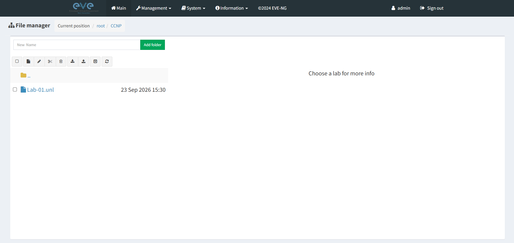

# 01 — Introduction to GNS3 and EVE-NG

## 🎯 Objective

Understand the role of network emulation platforms in building, configuring, testing, and troubleshooting network environments.

This lecture introduced **GNS3** and **EVE-NG**, with EVE-NG selected as the primary platform for my hands-on networking labs.

---

## 🌐 What is GNS3?

**GNS3 (Graphical Network Simulator-3)** is a network simulation and emulation platform used to create virtual network topologies and practice configurations in a lab environment.

It can be used to work with routers, switches, firewalls, and other network appliances.

🔗 [GNS3 Marketplace](https://gns3.com/marketplace/appliances)

---

## 🖥️ What is EVE-NG?

**EVE-NG (Emulated Virtual Environment — Next Generation)** is a network emulation platform that allows users to build and operate virtual network topologies through a web-based interface.

It supports a wide range of network appliances, including:

* Cisco routers and switches
* IOL/IOU images
* QEMU-based appliances
* Firewalls
* Linux systems
* Multi-vendor network devices

For this PACI program, **EVE-NG is my primary networking lab environment**.

---

## ⚖️ GNS3 vs EVE-NG

| Feature                    | GNS3    | EVE-NG       |
| -------------------------- | ------- | ------------ |
| Network emulation          | ✅       | ✅            |
| Virtual network topologies | ✅       | ✅            |
| Multi-vendor support       | ✅       | ✅            |
| Web-based lab interface    | Limited | ✅            |
| IOL/IOU support            | ✅       | ✅            |
| QEMU appliances            | ✅       | ✅            |
| Used in my lab             | Studied | **Hands-on** |

> **Note:** GNS3 was studied as part of the PACI introduction to network simulators. EVE-NG was selected as the primary platform and was actually installed, configured, and verified.

---

## 🔐 Why Network Emulation Matters for Cybersecurity

Networking is a fundamental part of cybersecurity.

A network emulation environment provides a controlled way to understand and practice concepts such as:

* IP addressing and subnetting
* Routing and switching
* VLANs and trunking
* Network segmentation
* Access control
* Network troubleshooting
* Traffic analysis
* Network security architecture

Understanding how networks operate provides the foundation for later cybersecurity topics such as **network security, intrusion detection, traffic analysis, and security monitoring**.

---

## 🧪 My Lab Environment

For my PACI networking labs, I prepared an EVE-NG environment using:

* **VMware Workstation**
* **EVE-NG Community Edition**
* **Cisco IOL images**
* **Cisco Dynamips router images**
* **QEMU-based network appliances**
* **WinSCP** for file transfer
* **PuTTY / SSH** for administration
* **Wireshark** for network traffic analysis
* **Cisco Packet Tracer** for additional networking practice

GNS3 was studied conceptually but was **not installed** as part of this lab environment.

---

## 📸 Evidence

### EVE-NG Interface

The EVE-NG web interface was successfully accessed during the preparation of my networking lab environment.

---

## 🧠 Key Takeaways

* Network emulators allow networking concepts to be practiced in controlled virtual environments.
* GNS3 and EVE-NG provide platforms for building virtual network topologies.
* EVE-NG was selected as my primary hands-on networking environment.
* Working with routers, switches, and virtual appliances will support my upcoming CCNA networking labs.
* Strong networking fundamentals are important for progressing into cybersecurity.

---

## 📚 PACI Program

**Program:** PACI Cybersecurity Program
**Module:** CCNA 200-301
**Section:** 01 — Network Simulator & Basics
**Lecture:** 01 — Introduction to GNS3 and EVE-NG
**Status:** ✅ Completed
