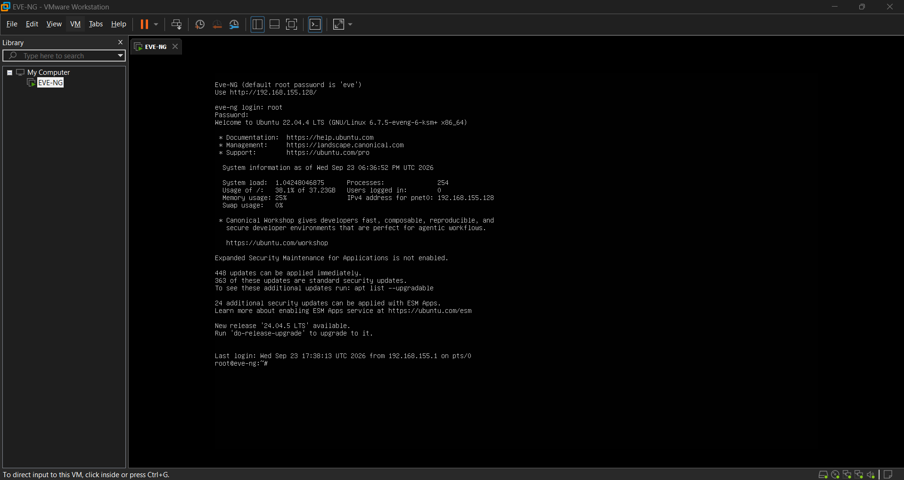
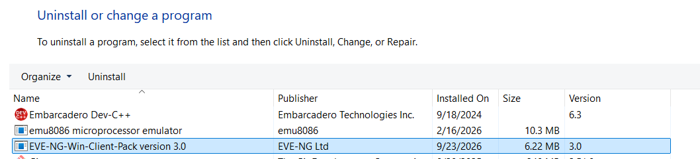
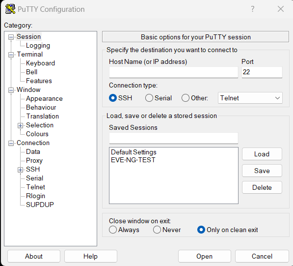
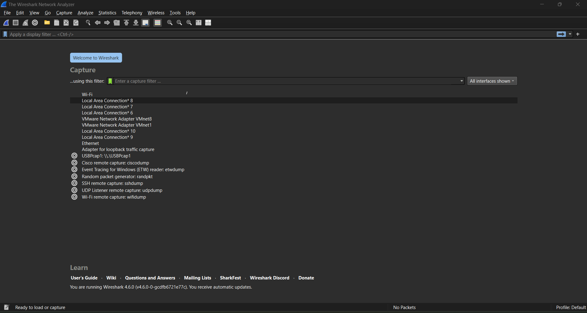

# 02 — EVE-NG Software Preparation

## 🎯 Objective

Prepare the required software and supporting tools for building and managing the **EVE-NG networking lab environment**.

This preparation included the virtualization platform, EVE-NG Windows Client Pack, file-transfer tools, SSH access, and network analysis software required for upcoming networking and cybersecurity labs.

---

## 🛠️ Software Prepared

The following tools were prepared for the EVE-NG lab environment:

| Software                       | Purpose                                                       |
| ------------------------------ | ------------------------------------------------------------- |
| **VMware Workstation**         | Runs the EVE-NG virtual machine                               |
| **EVE-NG Windows Client Pack** | Provides Windows-side integration with EVE-NG                 |
| **WinSCP**                     | Transfers files and network appliance images to the EVE-NG VM |
| **PuTTY**                      | Provides SSH access for EVE-NG administration                 |
| **Wireshark**                  | Captures and analyzes network traffic                         |

---

## 1. VMware Workstation

VMware Workstation was prepared as the virtualization platform for running the EVE-NG virtual machine.



---

## 2. EVE-NG Windows Client Pack

The **EVE-NG Windows Client Pack** was prepared to provide the required Windows-side client integration for the EVE-NG environment.



---

## 3. WinSCP

**WinSCP** was prepared for secure file transfer between the Windows host and the EVE-NG virtual machine.

It was later used to transfer network appliance images and supporting files to the appropriate EVE-NG directories.


---

## 4. PuTTY

**PuTTY** was prepared for SSH-based administration of the EVE-NG virtual machine.

This provides command-line access for tasks such as managing files, checking the environment, and applying EVE-NG configuration commands.



---

## 5. Wireshark

**Wireshark** was prepared as a network protocol analyzer for capturing and examining network traffic.

It will be useful during later networking and cybersecurity labs for understanding how packets move through a network.



---

## 🔗 How These Tools Work Together

The prepared environment follows this basic workflow:

```text
Windows Host
     │
     ├── VMware Workstation
     │        │
     │        └── EVE-NG Virtual Machine
     │
     ├── WinSCP ───────► Transfer images/files
     │
     ├── PuTTY / SSH ──► Manage EVE-NG
     │
     ├── EVE-NG Client Pack
     │        │
     │        └── Windows ↔ EVE-NG integration
     │
     └── Wireshark ────► Network traffic analysis
```

This creates the supporting environment required before building and testing network topologies.

---

## 📸 Preparation Evidence

### VMware Workstation


### EVE-NG Windows Client Pack


### WinSCP


### PuTTY


### Wireshark


---

## 🧠 Key Takeaways

* A virtualization platform is required to run the EVE-NG virtual environment.
* The EVE-NG Windows Client Pack provides Windows-side integration.
* WinSCP can be used to transfer appliance images and files to EVE-NG.
* PuTTY provides SSH-based administrative access.
* Wireshark provides packet capture and network traffic analysis capabilities.
* Preparing these tools creates the foundation for the upcoming EVE-NG installation and networking labs.

---

## 📚 PACI Program

**Program:** PACI Cybersecurity Program
**Module:** CCNA 200-301
**Section:** 01 — Network Simulator & Basics
**Lecture:** 02 — Download and Make Ready Software for EVE-NG
**Status:** ✅ Completed

