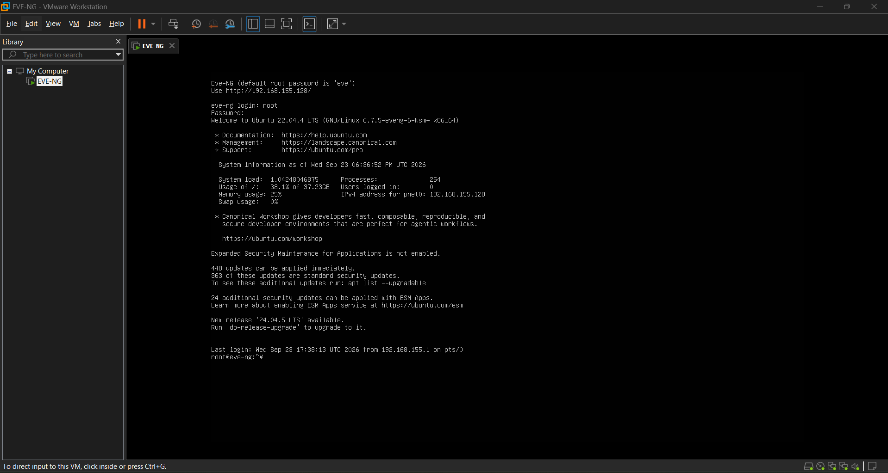
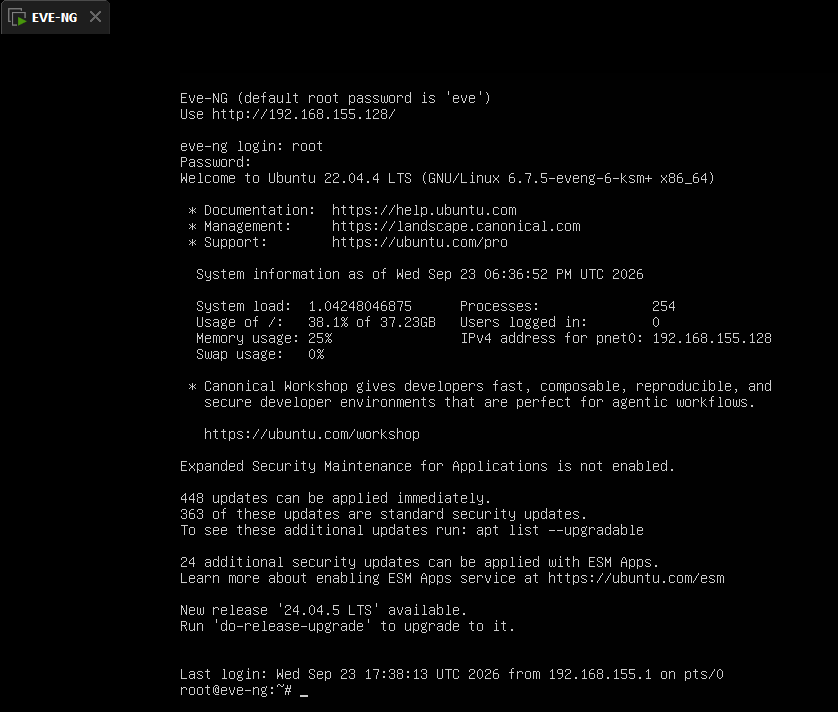
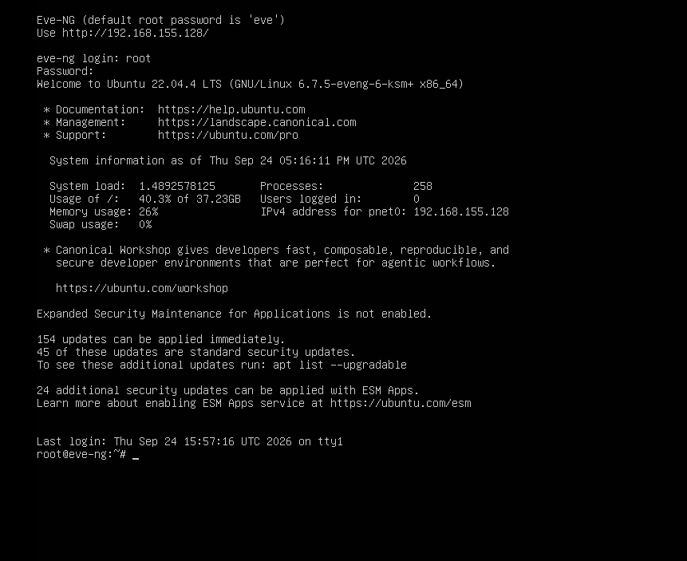
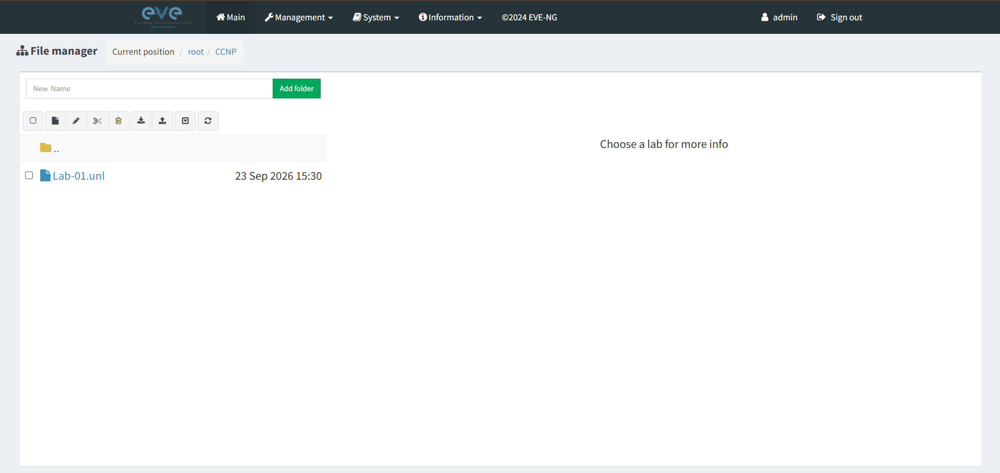
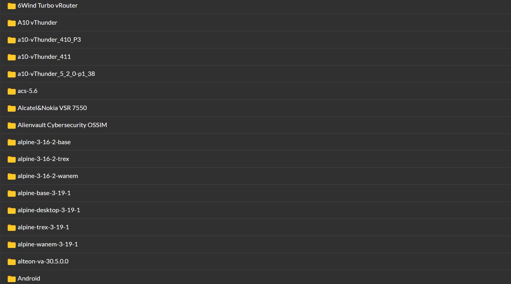
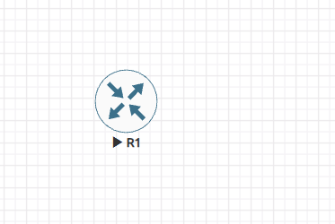
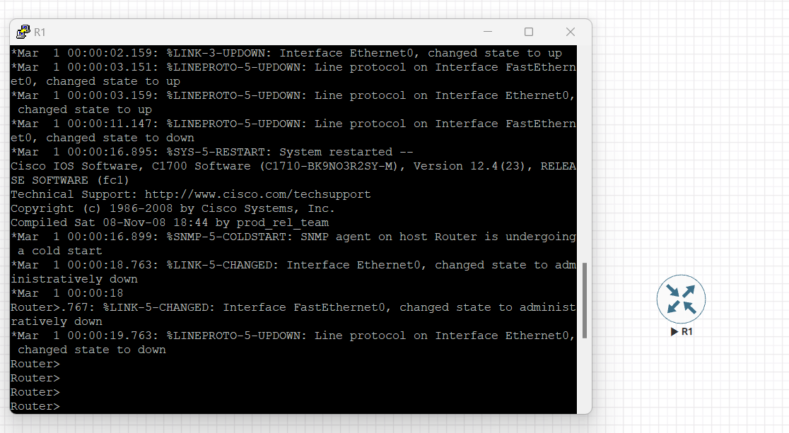
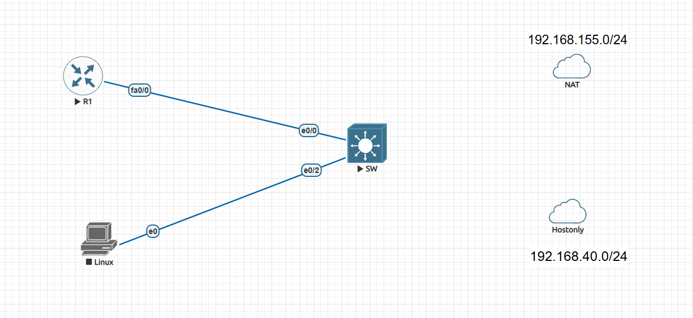
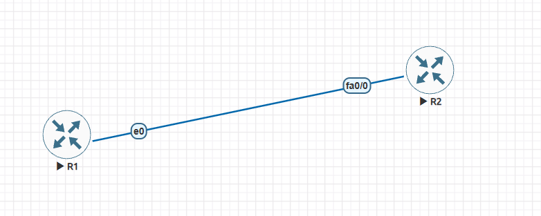

# 03 — EVE-NG Installation & Verification

> **PACI — CCNA 200-301 | Network Simulator & Basics**

## 🎯 Objective

The objective of this lab was to prepare an **EVE-NG network simulation environment**, verify that the virtual machine and web interface were working correctly, confirm that network device images were available, and perform a basic connectivity test between network devices.

This establishes the environment required for upcoming CCNA networking labs.

---

## 🧰 Environment

* EVE-NG
* Ubuntu 22.04.4 LTS
* Virtual Machine
* QEMU network device images
* Web browser
* Cisco network devices
* Basic IP connectivity testing

---

# 1. EVE-NG Virtual Machine

The first step was to verify that the EVE-NG virtual machine was successfully running.

The VM was started and the EVE-NG console became available.



**Verification:**
The EVE-NG virtual machine is running successfully and is ready for management access.

---

# 2. EVE-NG Console

After the virtual machine started, the EVE-NG console was accessed.



The console provides direct access to the EVE-NG operating environment and can be used for system-level troubleshooting and configuration.

---

# 3. EVE-NG Management IP Address

The EVE-NG system was checked for its management IP address.



The management interface received an IPv4 address, allowing the EVE-NG web interface to be accessed from the host system.

### Why this matters

The management IP is the address used to communicate with the EVE-NG server from the browser.

---

# 4. EVE-NG Web Interface

After confirming the management IP, the EVE-NG web interface was opened through a browser.



The web interface provides the graphical environment used to create network topologies, add devices, connect interfaces, and manage labs.

---

# 5. QEMU Images

The available QEMU-based network device images were verified inside the EVE-NG environment.



These images provide the network operating environments used by virtual routers, switches, and other network devices inside EVE-NG.

### Important

Having an image available does not automatically mean that a device has been successfully tested. The device should also be started and accessed through its console.

---

# 6. Test Node Running

A test network device was added to the EVE-NG laboratory environment and started.



This verifies that EVE-NG is capable of launching a virtual network node from the available device image.

---

# 7. EVE-NG Node Console

After starting the test node, its console was opened.



The node console provides access to the network device's command-line interface (CLI).

This is where commands such as interface configuration, routing configuration, and connectivity testing can be performed.

---

# 8. Network Topology Lab Architecture

A basic network topology was created in EVE-NG to verify device connectivity.



The topology provides a visual representation of the virtual network devices and their connections.

### Basic concept

```text
        Network Link
   ┌──────────┐       ┌──────────┐
   │    R1    │───────│    R2    │
   └──────────┘       └──────────┘
```

The purpose of this topology was not to build a complex network, but to verify that EVE-NG could create and connect virtual network devices.

---

# 9. Router Connection Testing

After connecting the network devices, basic connectivity was tested.



The test verifies that the virtual interfaces and network connection between the devices are functioning.

A successful connectivity test demonstrates that the environment is not only installed but is capable of performing actual network simulation.

---

# 🔍 Verification Summary

The following checks were completed:

| Verification              | Result |
| ------------------------- | ------ |
| EVE-NG VM running         | ✅      |
| EVE-NG console accessible | ✅      |
| Management IP available   | ✅      |
| Web interface accessible  | ✅      |
| QEMU images available     | ✅      |
| Test node started         | ✅      |
| Node console accessible   | ✅      |
| Network topology created  | ✅      |
| Router connection tested  | ✅      |

---

# 🧠 What I Learned

Through this setup, I learned how to:

* Prepare and start an EVE-NG virtual machine.
* Access the EVE-NG system through its console.
* Identify the EVE-NG management IP address.
* Access the EVE-NG web interface.
* Understand the role of QEMU device images.
* Add and start virtual network devices.
* Access a network device through its console.
* Create a basic virtual network topology.
* Test connectivity between network devices.

---

# 🛠️ Troubleshooting Concepts

During future EVE-NG labs, these checks will be useful when something does not work:

```text
VM running?
      ↓
Management IP available?
      ↓
Web interface accessible?
      ↓
Correct device image?
      ↓
Node started?
      ↓
Interface connected?
      ↓
Interface UP?
      ↓
IP addressing correct?
      ↓
Connectivity test successful?
```

This troubleshooting sequence helps identify problems systematically instead of randomly changing configurations.

---

# ✅ Lab Completion

**Status:** Completed

The EVE-NG environment was prepared and verified for use in upcoming CCNA networking laboratories.

---

## 📁 Evidence

All screenshots used as evidence for this lab are stored in:

```text
Screenshots/
```

The screenshots document the major stages from **EVE-NG startup and management access to network-node operation and connectivity testing**.

