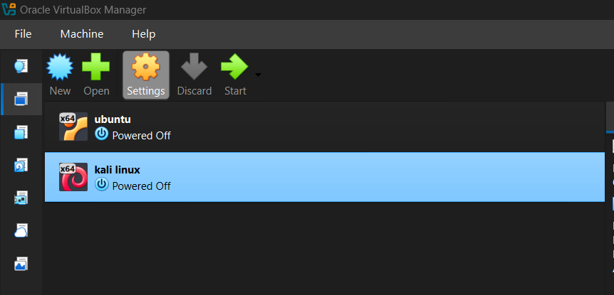
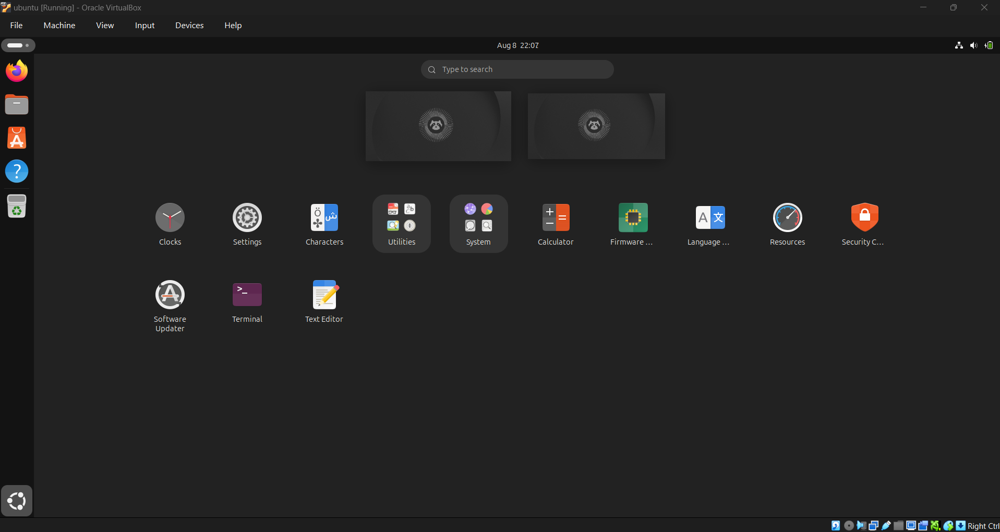
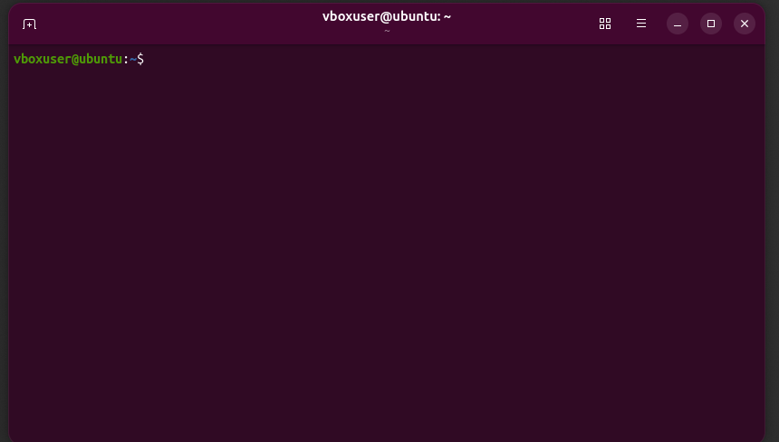
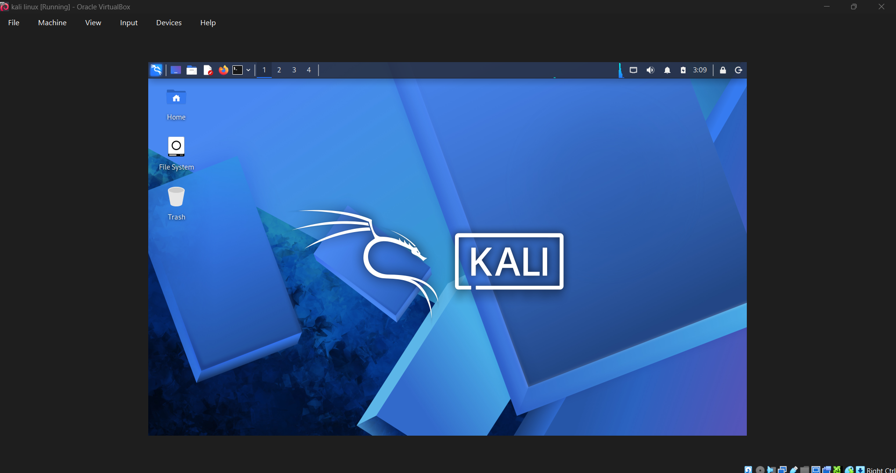
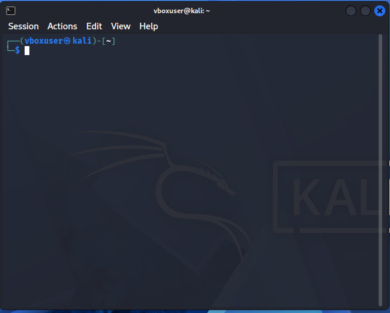

# Virtual Machines Setup

This project documents my hands-on setup of a virtual cybersecurity lab using **VirtualBox, Ubuntu, and Kali Linux**.

The purpose of this setup is to create a safe and isolated environment for learning and practicing cybersecurity concepts, Linux administration, networking, penetration testing, and security tools.

---

## 🛠️ Technologies & Tools Used

* Oracle VirtualBox
* Ubuntu Linux
* Kali Linux
* Windows Host Machine
* Virtual Machines (VMs)

---

## 🎯 Objective

The objective of this setup was to build a basic cybersecurity practice environment using virtual machines.

Instead of installing Linux directly on my physical computer, I used virtual machines so that I can:

* Practice Linux safely
* Learn cybersecurity tools
* Experiment with networking
* Perform security labs
* Practice penetration testing in an isolated environment
* Learn without affecting my main operating system

---

# 🏗️ Lab Structure

The virtual lab contains:

```text
Physical Computer
       │
       ▼
   VirtualBox
       │
       ├── Ubuntu VM
       │
       └── Kali Linux VM
```

### Ubuntu VM

Ubuntu is used as a general-purpose Linux environment for:

* Linux fundamentals
* Command-line practice
* System administration
* Networking concepts
* Linux experimentation

### Kali Linux VM

Kali Linux is used as the primary cybersecurity environment for:

* Cybersecurity labs
* Security tools
* Network security practice
* Reconnaissance
* Vulnerability assessment
* Penetration testing

---

# ⚙️ Setup Procedure

## 1. Install VirtualBox

The first step was to install **Oracle VirtualBox** on the Windows host machine.

VirtualBox provides the virtualization environment required to create, configure, and run virtual machines.

After installation, I opened the VirtualBox Manager to verify that the virtualization software was working correctly.



**Screenshot:** VirtualBox Manager used to manage the virtual machines.

---

## 2. Download and Set Up Ubuntu

After installing VirtualBox, I downloaded the Ubuntu virtual machine.

The Ubuntu VM was then imported/configured inside VirtualBox.

The purpose of using Ubuntu is to have a Linux environment for learning Linux fundamentals, command-line operations, networking, and system administration.

---

## 3. Start Ubuntu

After configuring the Ubuntu VM, I started the virtual machine through VirtualBox.

The Ubuntu desktop successfully loaded inside the virtual machine.



**Screenshot:** Ubuntu desktop running inside VirtualBox.

---

## 4. Verify Ubuntu Terminal

After starting Ubuntu, I opened the terminal to verify the Linux command-line environment.

The terminal will be used for practicing Linux commands, file-system operations, permissions, networking, and other cybersecurity-related activities.



**Screenshot:** Ubuntu terminal running inside the virtual machine.

---

## 5. Download and Set Up Kali Linux

After completing the Ubuntu setup, I downloaded the **Kali Linux virtual machine**.

Kali Linux was selected because it provides a dedicated environment for cybersecurity learning and contains many security-related tools.

The Kali Linux VM was imported/configured in VirtualBox.

---

## 6. Start Kali Linux

After configuring the Kali Linux VM, I started it through VirtualBox.

The Kali Linux desktop successfully loaded inside the virtual machine.



**Screenshot:** Kali Linux desktop running inside VirtualBox.

---

## 7. Verify Kali Linux Terminal

After starting Kali Linux, I opened the terminal to verify the command-line environment.

The Kali terminal will be used for future cybersecurity labs, Linux practice, networking, reconnaissance, vulnerability assessment, and security-tool experimentation.



**Screenshot:** Kali Linux terminal running inside the virtual machine.

---

# 🧪 Final Lab Environment

After completing the setup, the basic virtual cybersecurity laboratory was ready.

```text
                    Windows Host Machine
                            │
                            ▼
                       VirtualBox
                       /         \
                      /           \
                     ▼             ▼
                Ubuntu VM      Kali Linux VM
                    │                │
                    ▼                ▼
             Linux Practice     Cybersecurity
             Administration     Tools & Labs
             Networking          Security Testing
```

The two virtual machines provide separate Linux environments that can be used for different learning and cybersecurity activities.

---

# 📸 Screenshots

The setup has been documented with screenshots showing the important stages of the environment.

| Screenshot               | Description                          |
| ------------------------ | ------------------------------------ |
| `virtualbox-manager.png` | VirtualBox Manager                   |
| `ubuntu-desktop.png`     | Ubuntu desktop running in the VM     |
| `ubuntu-terminal.png`    | Ubuntu terminal                      |
| `kali-desktop.png`       | Kali Linux desktop running in the VM |
| `kali-terminal.png`      | Kali Linux terminal                  |

All screenshots are available in the [`Screenshots`](Screenshots/) directory.

---

# ✅ Setup Verification

The following components were successfully completed:

* [x] VirtualBox installed
* [x] Ubuntu VM downloaded
* [x] Ubuntu VM configured
* [x] Ubuntu VM started successfully
* [x] Ubuntu terminal verified
* [x] Kali Linux VM downloaded
* [x] Kali Linux VM configured
* [x] Kali Linux VM started successfully
* [x] Kali Linux terminal verified
* [x] Setup screenshots documented
* [x] Basic cybersecurity lab environment prepared

---

# 📚 What I Learned

During this setup, I gained practical experience with:

* Virtualization concepts
* Virtual machine management
* Oracle VirtualBox
* Ubuntu Linux
* Kali Linux
* Linux terminal environments
* Setting up isolated practice environments
* Preparing a laboratory for cybersecurity learning

This setup also helped me understand how different operating systems can be run and managed inside virtual machines without replacing the main operating system.

---

# 🔐 Security & Ethical Use

The virtual machines will be used for **educational and authorized cybersecurity practice only**.

Any penetration testing, vulnerability assessment, scanning, or security testing should only be performed against systems that I own or have explicit permission to test.

---

# 🚀 Next Steps

With the virtual environment ready, the next stage of my cybersecurity learning will focus on practical skills.

### Planned Learning Areas

1. Linux fundamentals
2. Linux command line
3. Linux file system
4. Users and permissions
5. Processes and services
6. Networking fundamentals
7. TCP/IP
8. DNS
9. HTTP/HTTPS
10. Network analysis
11. Cybersecurity fundamentals
12. Reconnaissance
13. Vulnerability assessment
14. Penetration testing fundamentals
15. Security tools
16. Practical cybersecurity labs

---

# 📁 Repository Structure

```text
Virtual Machines Setup/
│
├── README.md
│
└── Screenshots/
    ├── virtualbox-manager.png
    ├── ubuntu-desktop.png
    ├── ubuntu-terminal.png
    ├── kali-desktop.png
    └── kali-terminal.png
```

---

## 👤 Author

**Muhammad-Mehrab-Ali-dev**

This repository documents my hands-on cybersecurity learning journey, including practical setup, configuration, experimentation, and security lab work.
